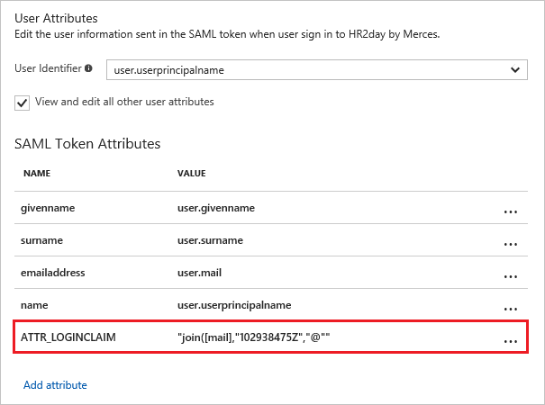
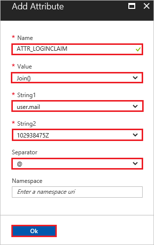
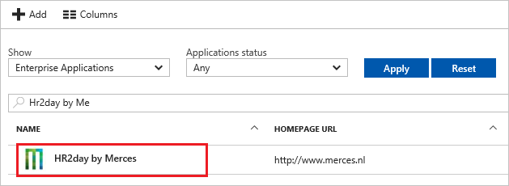

# Tutorial: Azure Active Directory integration with HR2day by Merces

In this tutorial, you learn how to integrate HR2day by Merces with Azure Active Directory (Azure AD).

Integrating HR2day by Merces with Azure AD provides you with the following benefits:

- You can control in Azure AD who has access to HR2day by Merces
- You can enable your users to automatically get signed-on to HR2day by Merces (Single Sign-On) with their Azure AD accounts
- You can manage your accounts in one central location - the Azure portal

If you want to know more details about SaaS app integration with Azure AD, see [what is application access and single sign-on with Azure Active Directory](active-directory-appssoaccess-whatis.md).

## Prerequisites

To configure Azure AD integration with HR2day by Merces, you need the following items:

- An Azure AD subscription
- An HR2day by Merces single sign-on enabled subscription

> [!NOTE]
> To test the steps in this tutorial, we do not recommend using a production environment.

To test the steps in this tutorial, you should follow these recommendations:

- Do not use your production environment, unless it is necessary.
- If you don't have an Azure AD trial environment, you can get a one-month trial [here](https://azure.microsoft.com/pricing/free-trial/).

## Scenario description
In this tutorial, you test Azure AD single sign-on in a test environment. 
The scenario outlined in this tutorial consists of two main building blocks:

1. Adding HR2day by Merces from the gallery
2. Configuring and testing Azure AD single sign-on

## Adding HR2day by Merces from the gallery
To configure the integration of HR2day by Merces into Azure AD, you need to add HR2day by Merces from the gallery to your list of managed SaaS apps.

**To add HR2day by Merces from the gallery, perform the following steps:**

1. In the **[Azure portal](https://portal.azure.com)**, on the left navigation panel, click **Azure Active Directory** icon. 

	![Active Directory][1]

2. Navigate to **Enterprise applications**. Then go to **All applications**.

	![Applications][2]
	
3. To add new application, click **New application** button on the top of dialog.

	![Applications][3]

4. In the search box, type **HR2day by Merces**.

	

5. In the results panel, select **HR2day by Merces**, and then click **Add** button to add the application.

	

##  Configuring and testing Azure AD single sign-on
In this section, you configure and test Azure AD single sign-on with HR2day by Merces based on a test user called "Britta Simon".

For single sign-on to work, Azure AD needs to know what the counterpart user in HR2day by Merces is to a user in Azure AD. In other words, a link relationship between an Azure AD user and the related user in HR2day by Merces needs to be established.

In HR2day by Merces, assign the value of the **user name** in Azure AD as the value of the **Username** to establish the link relationship.

To configure and test Azure AD single sign-on with HR2day by Merces, you need to complete the following building blocks:

1. **[Configuring Azure AD Single Sign-On](#configuring-azure-ad-single-sign-on)** - to enable your users to use this feature.
2. **[Creating an Azure AD test user](#creating-an-azure-ad-test-user)** - to test Azure AD single sign-on with Britta Simon.
3. **[Creating an HR2day by Merces test user](#creating-an-hr2day-by-merces-test-user)** - to have a counterpart of Britta Simon in HR2day by Merces that is linked to the Azure AD representation of user.
4. **[Assigning the Azure AD test user](#assigning-the-azure-ad-test-user)** - to enable Britta Simon to use Azure AD single sign-on.
5. **[Testing Single Sign-On](#testing-single-sign-on)** - to verify whether the configuration works.

### Configuring Azure AD single sign-on

In this section, you enable Azure AD single sign-on in the Azure portal and configure single sign-on in your HR2day by Merces application.

**To configure Azure AD single sign-on with HR2day by Merces, perform the following steps:**

1. In the Azure portal, on the **HR2day by Merces** application integration page, click **Single sign-on**.

	![Configure Single Sign-On][4]

2. On the **Single sign-on** dialog, select **Mode** as	**SAML-based Sign-on** to enable single sign-on.
 
	

3. On the **HR2day by Merces Domain and URLs** section, perform the following steps:

	

    a. In the **Sign-on URL** textbox, type a URL using the following pattern: `https://<tenantname>.force.com/<instancename>`

	b. In the **Identifier** textbox, type a URL using the following pattern: `https://hr2day.force.com/<companyname>`

	> [!NOTE] 
	> These values are not real. Update these values with the actual Sign-On URL and Identifier. Contact [HR2day by Merces Client support team](mailto:servicedesk@merces.nl) to get these values. 
 

4. On the **SAML Signing Certificate** section, click **Certificate(Base64)** and then save the certificate file on your computer.

	 

5. The objective of this section is to outline how to enable users to authenticate to HR2day by Merces with their account in Azure AD using federation based on the SAML protocol.

    Your HR2day by Merces application expects the SAML assertions in a specific format, which requires you to add custom attribute mappings to your SAML token attributes configuration. The following screenshot shows an example for this. 

    
	
	> [!NOTE] 
    Before you can configure the SAML assertion, you need to contact [HR2day by Merces Client support team](mailto:servicedesk@merces.nl) and request the value of the unique identifier attribute for your tenant. You need this value to complete the steps in the next section.	

6. In the **User Attributes** section on the **Single sign-on** dialog, configure SAML token attribute as shown in the image and perform the following steps:
	
      | Attribute Name    |   Attribute Value |  
    | ------------------- | -------------------- |    
	| ATTR_LOGINCLAIM | join([mail],"102938475Z","@" |
	
	  a. Click **Add attribute** to open the **Add Attribute** dialog.

	

	

	b. In the **Name** textbox, type **“ATTR_LOGINCLAIM”**.

	c. From the **Value** list, select **Join()**.

	d. From the **String1** list, select **user.mail**.

	e. From the **String2** list, type the **unique identifier** provided by your HR2day team.

	f. In the **Separator** textbox, type **@**.
	
	g. Click **Ok**.

7. Click **Save** button.

	

8. On the **HR2day by Merces Configuration** section, click **Configure HR2day by Merces** to open **Configure sign-on** window. Copy the **Sign-Out URL, SAML Entity ID, and SAML Single Sign-On Service URL** from the **Quick Reference section.**

	 

9. To get SSO configured for your application, contact your  [HR2day by Merces Client support team](emailTo:servicedesk@merces.nl) and attach the downloaded **Certificate(Base64)** file to your email. Also please do provide the **Sign-Out URL, SAML Entity ID, and SAML Single Sign-On Service URL** so that they can be configured for SSO integration.

    > [!NOTE]
    > Please mention to Merces team that this integration need Entity ID to be set with this pattern **https://hr2day.force.com/INSTANCENAME**
    > 
    > 

> [!TIP]
> You can now read a concise version of these instructions inside the [Azure portal](https://portal.azure.com), while you are setting up the app!  After adding this app from the **Active Directory > Enterprise Applications** section, simply click the **Single Sign-On** tab and access the embedded documentation through the **Configuration** section at the bottom. You can read more about the embedded documentation feature here: [Azure AD embedded documentation]( https://go.microsoft.com/fwlink/?linkid=845985)
> 

### Creating an Azure AD test user
The objective of this section is to create a test user in the Azure portal called Britta Simon.

![Create Azure AD User][100]

**To create a test user in Azure AD, perform the following steps:**

1. In the **Azure portal**, on the left navigation pane, click **Azure Active Directory** icon.

	 

2. To display the list of users, go to **Users and groups** and click **All users**.
	
	 

3. To open the **User** dialog, click **Add** on the top of the dialog.
 
	 

4. On the **User** dialog page, perform the following steps:
 
	 

    a. In the **Name** textbox, type **BrittaSimon**.

    b. In the **User name** textbox, type the **email address** of BrittaSimon.

	c. Select **Show Password** and write down the value of the **Password**.

    d. Click **Create**.
 
### Creating an HR2day by Merces test user

The objective of this section is to create a user called Britta Simon in HR2day by Merces. Please work with [HR2day by Merces Client support team](mailto:servicedesk@merces.nl) to add the users in the HR2day account. 

> [!NOTE]
> If you need to create an user manually, you need to 
> contact the [HR2day by Merces Client support team](mailto:servicedesk@merces.nl).

### Assigning the Azure AD test user

In this section, you enable Britta Simon to use Azure single sign-on by granting access to HR2day by Merces.

![Assign User][200] 

**To assign Britta Simon to HR2day by Merces, perform the following steps:**

1. In the Azure portal, open the applications view, and then navigate to the directory view and go to **Enterprise applications** then click **All applications**.

	![Assign User][201] 

2. In the applications list, select **HR2day by Merces**.

	 

3. In the menu on the left, click **Users and groups**.

	![Assign User][202] 

4. Click **Add** button. Then select **Users and groups** on **Add Assignment** dialog.

	![Assign User][203]

5. On **Users and groups** dialog, select **Britta Simon** in the Users list.

6. Click **Select** button on **Users and groups** dialog.

7. Click **Assign** button on **Add Assignment** dialog.
	
### Testing single sign-on

The objective of this section is to test your Azure AD single sign-on configuration using the Access Panel.  

When you click the HR2day by Merces tile in the Access Panel, you should get automatically signed-on to your HR2day by Merces application.

## Additional resources

* [List of Tutorials on How to Integrate SaaS Apps with Azure Active Directory](active-directory-saas-tutorial-list.md)
* [What is application access and single sign-on with Azure Active Directory?](active-directory-appssoaccess-whatis.md)

<!--Image references-->

[1]: ./media/active-directory-saas-hr2daybymerces-tutorial/tutorial_general_01.png
[2]: ./media/active-directory-saas-hr2daybymerces-tutorial/tutorial_general_02.png
[3]: ./media/active-directory-saas-hr2daybymerces-tutorial/tutorial_general_03.png
[4]: ./media/active-directory-saas-hr2daybymerces-tutorial/tutorial_general_04.png

[100]: ./media/active-directory-saas-hr2daybymerces-tutorial/tutorial_general_100.png

[200]: ./media/active-directory-saas-hr2daybymerces-tutorial/tutorial_general_200.png
[201]: ./media/active-directory-saas-hr2daybymerces-tutorial/tutorial_general_201.png
[202]: ./media/active-directory-saas-hr2daybymerces-tutorial/tutorial_general_202.png
[203]: ./media/active-directory-saas-hr2daybymerces-tutorial/tutorial_general_203.png

