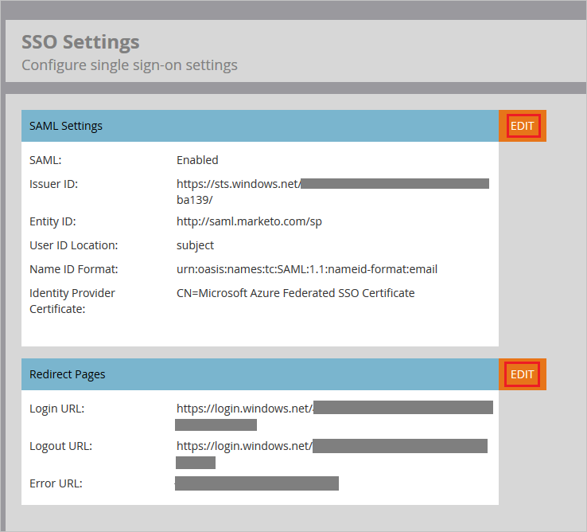
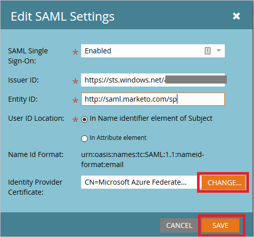
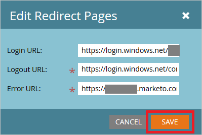
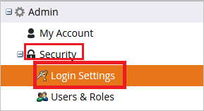
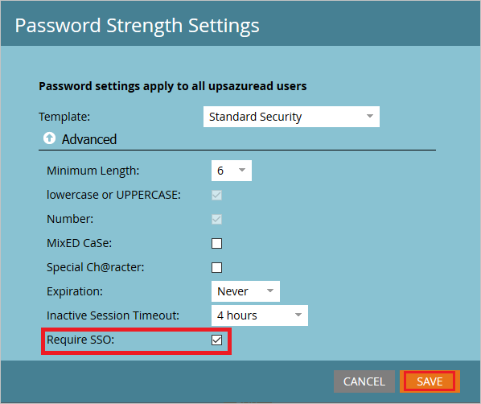
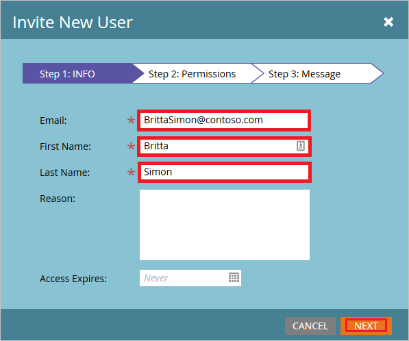
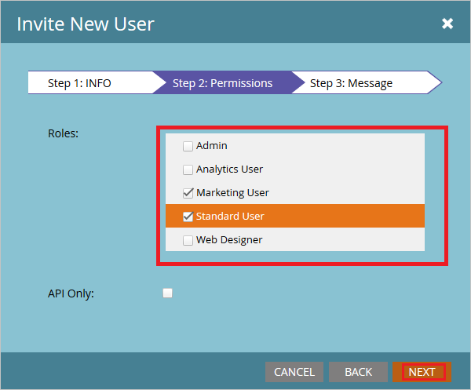
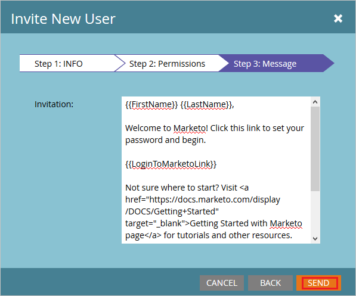

# Tutorial: Azure Active Directory integration with Marketo

In this tutorial, you learn how to integrate Marketo with Azure Active Directory (Azure AD).

Integrating Marketo with Azure AD provides you with the following benefits:

- You can control in Azure AD who has access to Marketo
- You can enable your users to automatically get signed-on to Marketo (Single Sign-On) with their Azure AD accounts
- You can manage your accounts in one central location - the Azure portal

If you want to know more details about SaaS app integration with Azure AD, see [what is application access and single sign-on with Azure Active Directory](active-directory-appssoaccess-whatis.md).

## Prerequisites

To configure Azure AD integration with Marketo, you need the following items:

- An Azure AD subscription
- A Marketo single-sign on enabled subscription

> [!NOTE]
> To test the steps in this tutorial, we do not recommend using a production environment.

To test the steps in this tutorial, you should follow these recommendations:

- Do not use your production environment, unless it is necessary.
- If you don't have an Azure AD trial environment, you can get a one-month trial [here](https://azure.microsoft.com/pricing/free-trial/).

## Scenario description
In this tutorial, you test Azure AD single sign-on in a test environment. 
The scenario outlined in this tutorial consists of two main building blocks:

1. Adding Marketo from the gallery
2. Configuring and testing Azure AD single sign-on

## Adding Marketo from the gallery
To configure the integration of Marketo into Azure AD, you need to add Marketo from the gallery to your list of managed SaaS apps.

**To add Marketo from the gallery, perform the following steps:**

1. In the **[Azure portal](https://portal.azure.com)**, on the left navigation panel, click **Azure Active Directory** icon. 

	![Active Directory][1]

2. Navigate to **Enterprise applications**. Then go to **All applications**.

	![Applications][2]
	
3. To add new application, click **New application** button on the top of dialog.

	![Applications][3]

4. In the search box, type **Marketo**.

	

5. In the results panel, select **Marketo**, and then click **Add** button to add the application.

	

##  Configuring and testing Azure AD single sign-on
In this section, you configure and test Azure AD single sign-on with Marketo based on a test user called "Britta Simon."

For single sign-on to work, Azure AD needs to know what the counterpart user in Marketo is to a user in Azure AD. In other words, a link relationship between an Azure AD user and the related user in Marketo needs to be established.

In Marketo, assign the value of the **user name** in Azure AD as the value of the **Username** to establish the link relationship.

To configure and test Azure AD single sign-on with Marketo, you need to complete the following building blocks:

1. **[Configuring Azure AD Single Sign-On](#configuring-azure-ad-single-sign-on)** - to enable your users to use this feature.
2. **[Creating an Azure AD test user](#creating-an-azure-ad-test-user)** - to test Azure AD single sign-on with Britta Simon.
3. **[Creating a Marketo test user](#creating-a-marketo-test-user)** - to have a counterpart of Britta Simon in Marketo that is linked to the Azure AD representation of user.
4. **[Assigning the Azure AD test user](#assigning-the-azure-ad-test-user)** - to enable Britta Simon to use Azure AD single sign-on.
5. **[Testing Single Sign-On](#testing-single-sign-on)** - to verify whether the configuration works.

### Configuring Azure AD single sign-on

In this section, you enable Azure AD single sign-on in the Azure portal and configure single sign-on in your Marketo application.

**To configure Azure AD single sign-on with Marketo, perform the following steps:**

1. In the Azure portal, on the **Marketo** application integration page, click **Single sign-on**.

	![Configure Single Sign-On][4]

2. On the **Single sign-on** dialog, select **Mode** as	**SAML-based Sign-on** to enable single sign-on.
 
	

3. On the **Marketo Domain and URLs** section, perform the following steps:

	

    a. In the **Identifier** textbox, type a URL using the following pattern: `https://saml.marketo.com/sp`

	b. In the **Reply URL** textbox, type a URL using the following pattern: `https://login.marketo.com/saml/assertion/\<munchkinid\>`

	> [!NOTE] 
	> These values are not real. Update these values with the actual Identifier and Reply URL. Contact [Marketo support team](http://investors.marketo.com/contactus.cfm) to get these values.
 
4. On the **SAML Signing Certificate** section, click **Certificate (Base64)** and then save the certificate file on your computer.

	 

5. Click **Save** button.

	

6. On the **Marketo Configuration** section, click **Configure Marketo** to open **Configure sign-on** window. Copy the **Sign-Out URL, SAML Entity ID, and SAML Single Sign-On Service URL** from the **Quick Reference section.**

	 

7. To get Munchkin Id of your application, log in to Marketo using admin credentials and perform following actions:
   
    a. Log in to Marketo app using admin credentials.
   
    b. Click the **Admin** button on the top navigation pane.
   
     
   
    c. Navigate to the Integration menu and click the **Munchkin link**.
   
    
   
    d. Copy the Munchkin Id shown on the screen and complete your Reply URL in the Azure AD configuration wizard.
   
     

8. To configure the SSO in the application, follow the below steps:
   
    a. Log in to Marketo app using admin credentials.
   
    b. Click the **Admin** button on the top navigation pane.
   
     
   
    c. Navigate to the Integration menu and click **Single Sign On**.
   
     
   
    d. To enable the SAML Settings, click **Edit** button.
   
     
   
    e. **Enabled** Single Sign-On settings.
   
    f. Paste the **SAML Entity ID**, in the **Issuer ID** textbox.
   
    g. In the **Entity ID** textbox, enter the URL as `http://saml.marketo.com/sp`.
   
    h. Select the User ID Location as **Name Identifier element**.
   
    
   
    > [!NOTE]
    > If your User Identifier is not UPN value then change the value in the Attribute tab.
   
    i. Upload the certificate, which you have downloaded from Azure AD configuration wizard. **Save** the settings.
   
    j. Edit the Redirect Pages settings.
   
    k. Paste the **SAML Single Sign-On Service URL** in the **Login URL** textbox.
   
    l. Paste the **Sign-Out URL** in the **Logout URL** textbox.
   
    m. In the **Error URL**, copy your **Marketo instance URL** and click **Save** button to save settings.
   
    

9. To enable the SSO for users, complete the following actions:
   
    a. Log in to Marketo app using admin credentials.
   
    b. Click the **Admin** button on the top navigation pane.
   
     
   
    c. Navigate to the **Security** menu and click **Login Settings**.
   
    
   
    d. Check the **Require SSO** option and **Save** the settings.
   
    

> [!TIP]
> You can now read a concise version of these instructions inside the [Azure portal](https://portal.azure.com), while you are setting up the app!  After adding this app from the **Active Directory > Enterprise Applications** section, simply click the **Single Sign-On** tab and access the embedded documentation through the **Configuration** section at the bottom. You can read more about the embedded documentation feature here: [Azure AD embedded documentation]( https://go.microsoft.com/fwlink/?linkid=845985)
> 

### Creating an Azure AD test user
The objective of this section is to create a test user in the Azure portal called Britta Simon.

![Create Azure AD User][100]

**To create a test user in Azure AD, perform the following steps:**

1. In the **Azure portal**, on the left navigation pane, click **Azure Active Directory** icon.

	 

2. To display the list of users, go to **Users and groups** and click **All users**.
	
	 

3. To open the **User** dialog, click **Add** on the top of the dialog.
 
	 

4. On the **User** dialog page, perform the following steps:
 
	 

    a. In the **Name** textbox, type **BrittaSimon**.

    b. In the **User name** textbox, type the **email address** of BrittaSimon.

	c. Select **Show Password** and write down the value of the **Password**.

    d. Click **Create**.
 
### Creating a Marketo test user

In this section, you create a user called Britta Simon in Marketo. follow these steps to create a user in Marketo platform.

1. Log in to Marketo app using admin credentials.

2. Click the **Admin** button on the top navigation pane.
   
     

3. Navigate to the **Security** menu and click **Users & Roles**
   
      

4. Click the **Invite New User** link on the Users tab
   
     

5. In the Invite New User wizard fill the following information
   
    a. Enter the user **Email** address in the textbox
   
    
   
    b. Enter the **First Name** in the textbox
   
    c. Enter the **Last Name**  in the textbox
   
    d. Click **Next**

6. In the **Permissions** tab, select the **userRoles** and click **Next**
   
    
7. Click the **Send** button to send the user invitation
   
    

8. User receives the email notification and has to click the link and change the password to activate the account. 

### Assigning the Azure AD test user

In this section, you enable Britta Simon to use Azure single sign-on by granting access to Marketo.

![Assign User][200] 

**To assign Britta Simon to Marketo, perform the following steps:**

1. In the Azure portal, open the applications view, and then navigate to the directory view and go to **Enterprise applications** then click **All applications**.

	![Assign User][201] 

2. In the applications list, select **Marketo**.

	 

3. In the menu on the left, click **Users and groups**.

	![Assign User][202] 

4. Click **Add** button. Then select **Users and groups** on **Add Assignment** dialog.

	![Assign User][203]

5. On **Users and groups** dialog, select **Britta Simon** in the Users list.

6. Click **Select** button on **Users and groups** dialog.

7. Click **Assign** button on **Add Assignment** dialog.
	
### Testing single sign-on

In this section, you test your Azure AD single sign-on configuration using the Access Panel.

When you click the Marketo tile in the Access Panel, you should get automatically signed-on to your Marketo application.

## Additional resources

* [List of Tutorials on How to Integrate SaaS Apps with Azure Active Directory](active-directory-saas-tutorial-list.md)
* [What is application access and single sign-on with Azure Active Directory?](active-directory-appssoaccess-whatis.md)

<!--Image references-->

[1]: ./media/active-directory-saas-marketo-tutorial/tutorial_general_01.png
[2]: ./media/active-directory-saas-marketo-tutorial/tutorial_general_02.png
[3]: ./media/active-directory-saas-marketo-tutorial/tutorial_general_03.png
[4]: ./media/active-directory-saas-marketo-tutorial/tutorial_general_04.png

[100]: ./media/active-directory-saas-marketo-tutorial/tutorial_general_100.png

[200]: ./media/active-directory-saas-marketo-tutorial/tutorial_general_200.png
[201]: ./media/active-directory-saas-marketo-tutorial/tutorial_general_201.png
[202]: ./media/active-directory-saas-marketo-tutorial/tutorial_general_202.png
[203]: ./media/active-directory-saas-marketo-tutorial/tutorial_general_203.png

