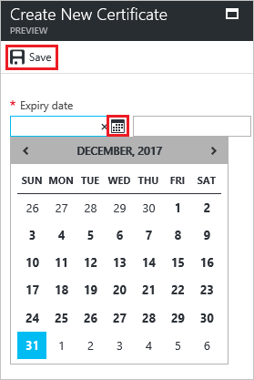
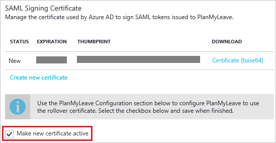
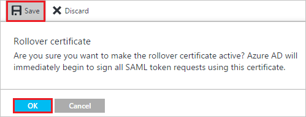
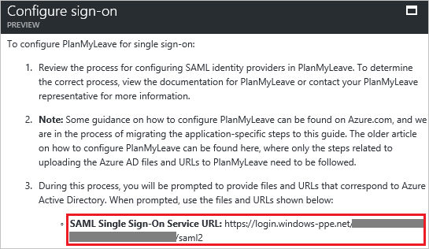
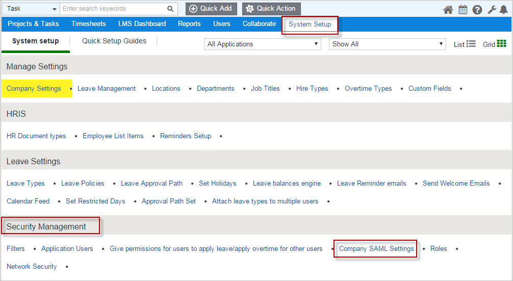
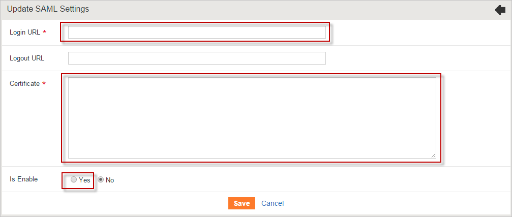

# Tutorial: Azure Active Directory integration with PlanMyLeave

In this tutorial, you learn how to integrate PlanMyLeave with Azure Active Directory (Azure AD).

Integrating PlanMyLeave with Azure AD provides you with the following benefits:

- You can control in Azure AD who has access to PlanMyLeave
- You can enable your users to automatically get signed-on to PlanMyLeave (Single Sign-On) with their Azure AD accounts
- You can manage your accounts in one central location - the Azure Management portal

If you want to know more details about SaaS app integration with Azure AD, see [What is application access and single sign-on with Azure Active Directory](active-directory-appssoaccess-whatis.md).

## Prerequisites

To configure Azure AD integration with PlanMyLeave, you need the following items:

- An Azure AD subscription
- A PlanMyLeave single-sign on enabled subscription

> [!NOTE]
> To test the steps in this tutorial, we do not recommend using a production environment.

To test the steps in this tutorial, you should follow these recommendations:

- You should not use your production environment, unless this is necessary.
- If you don't have an Azure AD trial environment, you can get an one-month trial [here](https://azure.microsoft.com/pricing/free-trial/).

## Scenario description
In this tutorial, you test Azure AD single sign-on in a test environment. 
The scenario outlined in this tutorial consists of two main building blocks:

1. Adding PlanMyLeave from the gallery
2. Configuring and testing Azure AD single sign-on

## Adding PlanMyLeave from the gallery
To configure the integration of PlanMyLeave into Azure AD, you need to add PlanMyLeave from the gallery to your list of managed SaaS apps.

**To add PlanMyLeave from the gallery, perform the following steps:**

1. In the **[Azure Management Portal](https://portal.azure.com)**, on the left navigation panel, click **Azure Active Directory** icon. 

	![Active Directory][1]

2. Navigate to **Enterprise applications**. Then go to **All applications**.

	![Applications][2]
	
3. Click **Add** button on the top of the dialog.

	![Applications][3]

4. In the search box, type **PlanMyLeave**.

	

5. In the results panel, select **PlanMyLeave**, and then click **Add** button to add the application.

	

##  Configuring and testing Azure AD single sign-on
In this section, you configure and test Azure AD single sign-on with PlanMyLeave based on a test user called "Britta Simon".

For single sign-on to work, Azure AD needs to know what the counterpart user in PlanMyLeave is to a user in Azure AD. In other words, a link relationship between an Azure AD user and the related user in PlanMyLeave needs to be established.

This link relationship is established by assigning the value of the **user name** in Azure AD as the value of the **Username** in PlanMyLeave.

To configure and test Azure AD single sign-on with PlanMyLeave, you need to complete the following building blocks:

1. **[Configuring Azure AD Single Sign-On](#configuring-azure-ad-single-sign-on)** - to enable your users to use this feature.
2. **[Creating an Azure AD test user](#creating-an-azure-ad-test-user)** - to test Azure AD single sign-on with Britta Simon.
3. **[Creating a PlanMyLeave test user](#creating-a-planmyleave-test-user)** - to have a counterpart of Britta Simon in PlanMyLeave that is linked to the Azure AD representation of her.
4. **[Assigning the Azure AD test user](#assigning-the-azure-ad-test-user)** - to enable Britta Simon to use Azure AD single sign-on.
5. **[Testing Single Sign-On](#testing-single-sign-on)** - to verify whether the configuration works.

### Configuring Azure AD single sign-on

In this section, you enable Azure AD single sign-on in the Azure Management portal and configure single sign-on in your PlanMyLeave application.

**To configure Azure AD single sign-on with PlanMyLeave, perform the following steps:**

1. In the Azure Management portal, on the **PlanMyLeave** application integration page, click **Single sign-on**.

	![Configure Single Sign-On][4]

2. On the **Single sign-on** dialog page, as **Mode** select **SAML-based Sign-on** to enable single sign on.
 
	

3. On the **PlanMyLeave Domain and URLs** section, perform the following steps:

	

    a. In the **Sign On URL** textbox, type a URL using the following pattern: `https://<company-name>.planmyleave.com/Login.aspx`
	
	b. In the **Identifer** textbox, type a URL using the following pattern: `https://<company-name>.planmyleave.com`

	> [!NOTE] 
	> Please note that these are not the real values. You have to update these values with the actual Sign On URL and Identifier. Contact [PlanMyLeave support team](mailto:support@planmyleave.com) to get these values.

4. On the **SAML Signing Certificate** section, click **Create new certificate**.

	 	

5. On the **Create New Certificate** dialog, click the calendar icon and select an **expiry date**. Then click **Save** button.

	

6. On the **SAML Signing Certificate** section, select **Make new certificate active** and click **Save** button.

	

7. On the pop-up **Rollover certificate** window, click **OK**.

	

8. On the **SAML Signing Certificate** section, click **Certificate (base64)** and then save the certificate file on your computer.

	 

9. On the **PlanMyLeave Configuration** section, click **Configure PlanMyLeave** to open **Configure sign-on** window.

	 

	

10. In a different web browser window, log into your PlanMyLeave tenant as an administrator.

11. Go to **System Setup**. Then on the **Security Management** section click **Company SAML settings** .

	 

12. On the **SAML Settings** section, click editor icon.

	

13. On the **Update SAML Settings** section, perform the following steps:

	

	a.  In the **Login URL** textbox, put the value of **SAML Single Sign-On Service URL** from Azure AD application configuration window.

    b.  Open your downloaded certificate file in notepad, copy only the content between the ---Begin Certificate--- and ---End certificate---- of it into your clipboard, and then paste it to the **Certificate** textbox.

	c. Set "**Is Enable**" to "**Yes**".

	d. Click **Save**.

### Creating an Azure AD test user
The objective of this section is to create a test user in the Azure Management portal called Britta Simon.

![Create Azure AD User][100]

**To create a test user in Azure AD, perform the following steps:**

1. In the **Azure Management portal**, on the left navigation pane, click **Azure Active Directory** icon.

	 

2. Go to **Users and groups** and click **All users** to display the list of users.
	
	 

3. At the top of the dialog click **Add** to open the **User** dialog.
 
	 

4. On the **User** dialog page, perform the following steps:
 
	 

    a. In the **Name** textbox, type **BrittaSimon**.

    b. In the **User name** textbox, type the **email address** of BrittaSimon.

	c. Select **Show Password** and write down the value of the **Password**.

    d. Click **Create**. 

### Creating a PlanMyLeave test user

The objective of this section is to create a user called Britta Simon in PlanMyLeave. PlanMyLeave supports just-in-time provisioning, which is by default enabled.

There is no action item for you in this section. A new user will be created during an attempt to access PlanMyLeave if it doesn't exist yet.

> [!NOTE]
> If you need to create an user manually, you need to contact [PlanMyLeave support team](mailto:support@planmyleave.com).

### Assigning the Azure AD test user

In this section, you enable Britta Simon to use Azure single sign-on by granting her access to PlanMyLeave.

![Assign User][200] 

**To assign Britta Simon to PlanMyLeave, perform the following steps:**

1. In the Azure Management portal, open the applications view, and then navigate to the directory view and go to **Enterprise applications** then click **All applications**.

	![Assign User][201] 

2. In the applications list, select **PlanMyLeave**.

	 

3. In the menu on the left, click **Users and groups**.

	![Assign User][202] 

4. Click **Add** button. Then select **Users and groups** on **Add Assignment** dialog.

	![Assign User][203]

5. On **Users and groups** dialog, select **Britta Simon** in the Users list.

6. Click **Select** button on **Users and groups** dialog.

7. Click **Assign** button on **Add Assignment** dialog.
	

### Testing single sign-on

In this section, you test your Azure AD single sign-on configuration using the Access Panel.

When you click the PlanMyLeave tile in the Access Panel, you should get automatically signed-on to your PlanMyLeave application.

## Additional resources

* [List of Tutorials on How to Integrate SaaS Apps with Azure Active Directory](active-directory-saas-tutorial-list.md)
* [What is application access and single sign-on with Azure Active Directory?](active-directory-appssoaccess-whatis.md)

<!--Image references-->

[1]: ./media/active-directory-saas-planmyleave-tutorial/tutorial_general_01.png
[2]: ./media/active-directory-saas-planmyleave-tutorial/tutorial_general_02.png
[3]: ./media/active-directory-saas-planmyleave-tutorial/tutorial_general_03.png
[4]: ./media/active-directory-saas-planmyleave-tutorial/tutorial_general_04.png

[100]: ./media/active-directory-saas-planmyleave-tutorial/tutorial_general_100.png

[200]: ./media/active-directory-saas-planmyleave-tutorial/tutorial_general_200.png
[201]: ./media/active-directory-saas-planmyleave-tutorial/tutorial_general_201.png
[202]: ./media/active-directory-saas-planmyleave-tutorial/tutorial_general_202.png
[203]: ./media/active-directory-saas-planmyleave-tutorial/tutorial_general_203.png