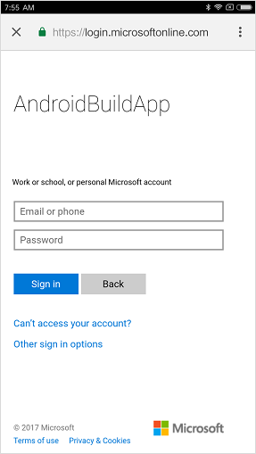
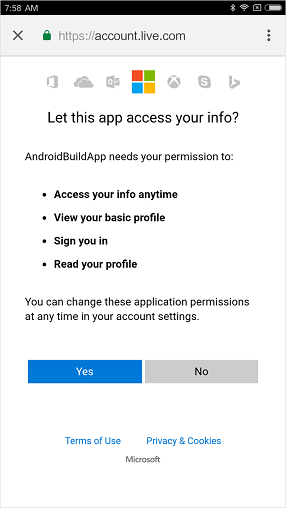

## Test your code

1. Deploy your code to your device/emulator.
2. When you're ready to test, use a Microsoft Azure Active Directory (organizational account) or a Microsoft Account (live.com, outlook.com) account to sign in. 

  

### Consent
The first time a user signs in to your application, they will be presented with a consent screen similar to the below, where they need to explicitly accept: 

### Expected results
You should see the results of a call to Microsoft Graph API ‘me’ endpoint used to to obtain the user profile - https://graph.microsoft.com/v1.0/me. For a list of common Microsoft Graph endpoints, please see this [article](https://developer.microsoft.com/graph/docs#common-microsoft-graph-queries).

<!--start-collapse-->
### More information about scopes and delegated permissions
Graph API requires the `user.read` scope to read user profile. This scope is added by default to every application registered through our registration portal. Some other Graph APIs as well as custom APIs for your backend server require additional scopes. For example, for Graph, `Calendars.Read` is required to list user’s calendars. In order to access the user’s calendar in the context of an application, you need to add this delegated application registration’s information and then add `Calendars.Read` to the `AcquireTokenAsync` call. The user may be prompted for additional consent as you increase the number of scopes.

If a backend API does not require a scope (not recommended), you can use the `ClientId` as the scope in the `AcquireTokenAsync` call.
<!--end-collapse-->
