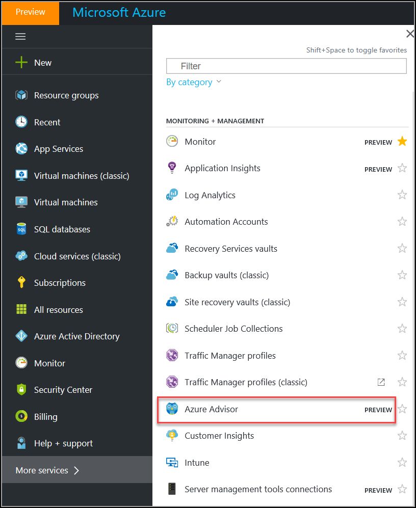
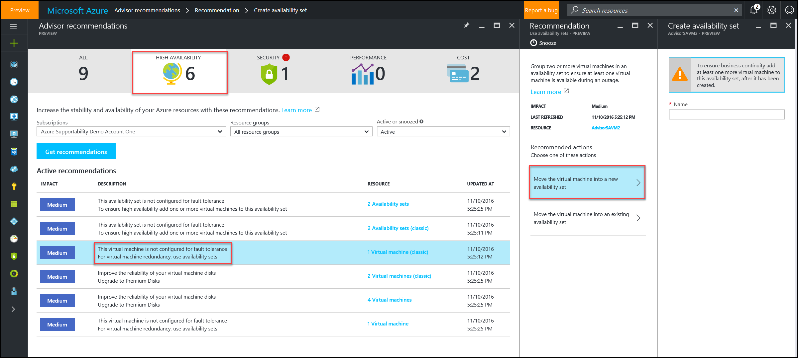
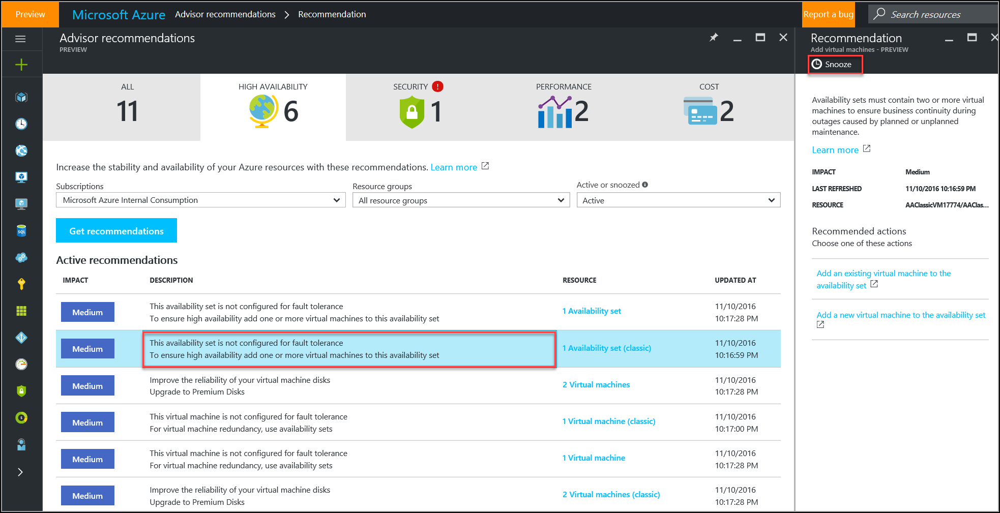

# Get started with Azure Advisor

Learn how to access Advisor through the Azure portal, get recommendations, implement recommendations, search for recommendations, and refresh recommendations.

## Get Advisor recommendations

1. Sign in to the [Azure portal](https://portal.azure.com).

2. In the left pane, click **More services**.

3. In the service menu pane, under **Monitoring and Management**, click **Azure Advisor**.  
 The Advisor dashboard is displayed.

    

4. On the Advisor dashboard, select the subscription for which you want to receive recommendations.  
The Advisor dashboard displays personalized recommendations for a selected subscription. 

5. To get recommendations for a particular category, click one of the tabs: **High Availability**, **Security**, **Performance**, or **Cost**.
 
> [!NOTE]
> To access Advisor recommendations, you must first *register your subscription* with Advisor. A subscription is registered when a *subscription Owner* launches the Advisor dashboard and clicks the **Get recommendations** button. This is a *one-time operation*. After the subscription is registered, you can access Advisor recommendations as *Owner*, *Contributor*, or *Reader* for a subscription, a resource group, or a specific resource.

  

## Get Advisor recommendation details, and implement a solution

The **Recommendation** blade in Advisor offers additional information about the recommendation. 

1. Sign in to the [Azure portal](https://portal.azure.com), and then start [Azure Advisor](https://aka.ms/azureadvisordashboard).

2. On the **Advisor recommendations** dashboard, click **Get recommendations**.

3. In the list of recommendations, click a recommendation that you want to review in detail.  
The **Recommendation** blade is displayed.

4. On the **Recommendations** blade, review information about actions that you can perform to resolve a potential issue, or take advantage of a cost-saving opportunity. 
  
  

## Search for Advisor recommendations

You can search for recommendations for a particular subscription or resource group. You can also search for recommendations by status.

1. Sign in to the [Azure portal](https://portal.azure.com), and then start [Azure Advisor](https://aka.ms/azureadvisordashboard).

2. Search for recommendations by filtering for subscriptions, resource groups, and recommendation status (**Active** or **Snoozed**).

3. To display a list of Advisor recommendations that are based on your search-filter criteria, click **Get recommendations**.

  

## Snooze or dismiss Advisor recommendations

1. Sign in to the [Azure portal](https://portal.azure.com), and then start [Azure Advisor](https://aka.ms/azureadvisordashboard).

2. Click **Get recommendations**, and then, in the list of recommendations, click a recommendation.

3. On the **Recommendation** blade, click **Snooze**.  

   

4. Specify a snooze time period, or select **Never** to dismiss the recommendation.

## Next steps

To learn more about Advisor, see:
* [Introduction to Azure Advisor](advisor-overview.md)
* [Advisor High Availability recommendations](advisor-high-availability-recommendations.md)
* [Advisor Security recommendations](advisor-security-recommendations.md)
-  [Advisor Performance recommendations](advisor-performance-recommendations.md)
* [Advisor Cost recommendations](advisor-performance-recommendations.md)
