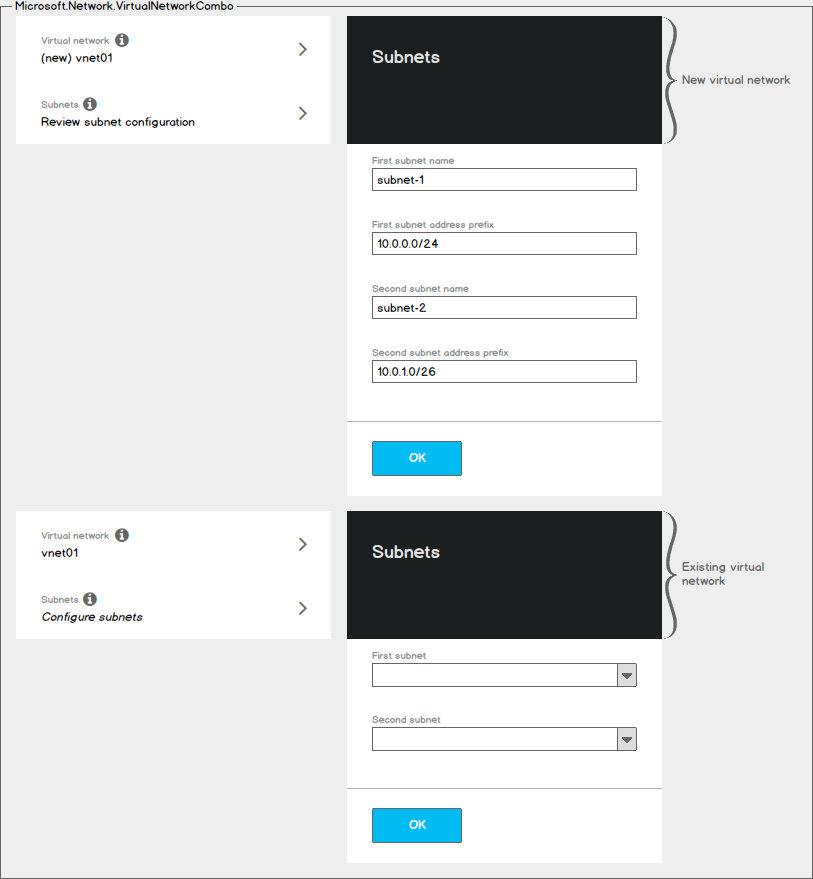

# Microsoft.Network.VirtualNetworkCombo UI element
A group of controls for selecting a new or existing virtual network. You use this element when [creating an Azure Managed Application](managed-application-publishing.md).

## UI sample


- In the top wireframe, the user has picked a new virtual network, so the user can customize each subnet's name and address prefix. Configuring
subnets in this case is optional.
- In the bottom wireframe, the user has picked an existing virtual network, so
the user must map each subnet the deployment template requires to an
existing subnet. Configuring subnets in this case is required.

## Schema
```json
{
  "name": "element1",
  "type": "Microsoft.Network.VirtualNetworkCombo",
  "label": {
    "virtualNetwork": "Virtual network",
    "subnets": "Subnets"
  },
  "toolTip": {
    "virtualNetwork": "",
    "subnets": ""
  },
  "defaultValue": {
    "name": "vnet01",
    "addressPrefixSize": "/16"
  },
  "constraints": {
    "minAddressPrefixSize": "/16"
  },
  "options": {
    "hideExisting": false
  },
  "subnets": {
    "subnet1": {
      "label": "First subnet",
      "defaultValue": {
        "name": "subnet-1",
        "addressPrefixSize": "/24"
      },
      "constraints": {
        "minAddressPrefixSize": "/24",
        "minAddressCount": 12,
        "requireContiguousAddresses": true
      }
    },
    "subnet2": {
      "label": "Second subnet",
      "defaultValue": {
        "name": "subnet-2",
        "addressPrefixSize": "/26"
      },
      "constraints": {
        "minAddressPrefixSize": "/26",
        "minAddressCount": 8,
        "requireContiguousAddresses": true
      }
    }
  },
  "visible": true
}
```

## Remarks
- If specified, the first non-overlapping address prefix of size
`defaultValue.addressPrefixSize` is determined automatically based on the
existing virtual networks in the user's subscription.
- The default value for `defaultValue.name` and `defaultValue.addressPrefixSize`
is **null**.
- `constraints.minAddressPrefixSize` must be specified. Any existing virtual
networks with an address space smaller than the specified value are unavailable for selection.
- `subnets` must be specified, and `constraints.minAddressPrefixSize` must be
specified for each subnet.
- When creating a new virtual network, each subnet's address prefix is
calculated automatically based on the virtual network's address prefix and the
respective `addressPrefixSize`.
- When using an existing virtual network, any subnets smaller than the
respective `constraints.minAddressPrefixSize` are unavailable for
selection. Additionally, if specified, subnets that do not contain at least
`minAddressCount` available addresses are unavailable for selection.
The default value is **0**. To ensure that the available addresses are contiguous,
specify **true** for `requireContiguousAddresses`. The default value is **true**.
- Creating subnets in an existing virtual network is not supported.
- If `options.hideExisting` is **true**, the user can't choose an
existing virtual network. The default value is **false**.

## Sample output
```json
{
  "name": "vnet01",
  "resourceGroup": "rg01",
  "addressPrefixes": ["10.0.0.0/16"],
  "newOrExisting": "new",
  "subnets": {
    "subnet1": {
      "name": "subnet-1",
      "addressPrefix": "10.0.0.0/24",
      "startAddress": "10.0.0.1"
    },
    "subnet2": {
      "name": "subnet-2",
      "addressPrefix": "10.0.1.0/26",
      "startAddress": "10.0.1.1"
    }
  }
}
```

## Next steps
* For an introduction to managed applications, see [Azure Managed Application overview](managed-application-overview.md).
* For an introduction to creating UI definitions, see [Getting started with CreateUiDefinition](managed-application-createuidefinition-overview.md).
* For a description of common properties in UI elements, see [CreateUiDefinition elements](managed-application-createuidefinition-elements.md).
