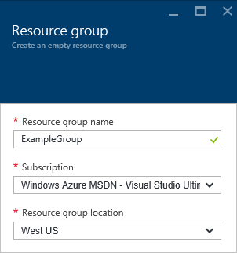
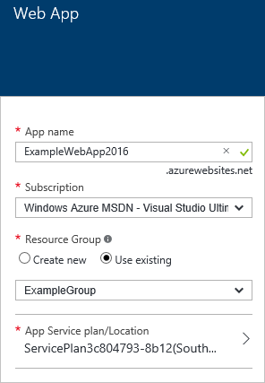
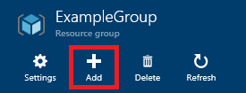
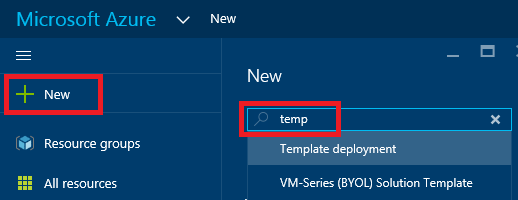
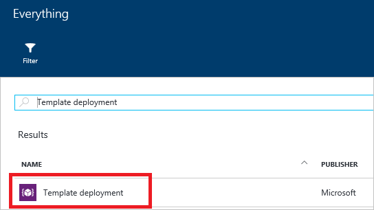
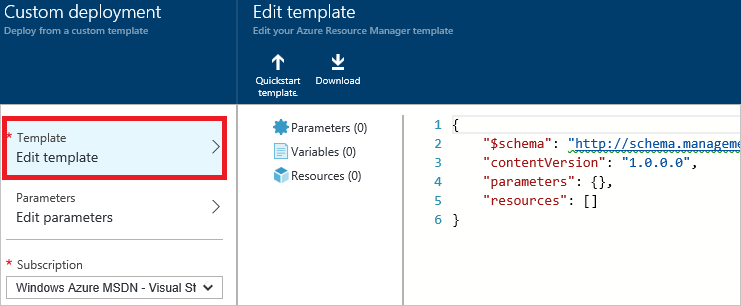
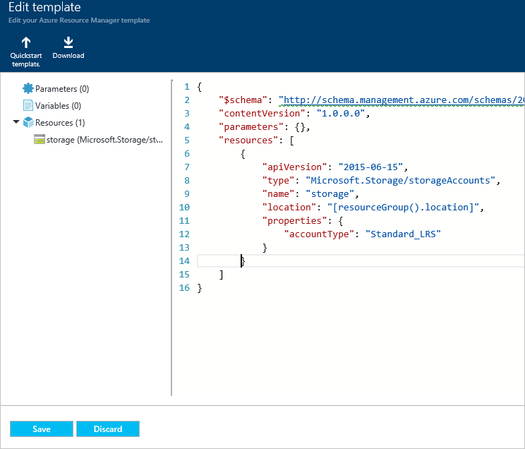
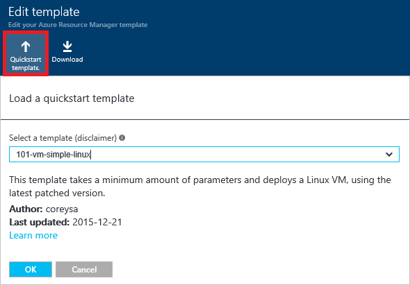
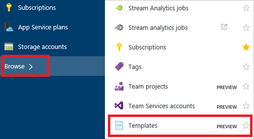
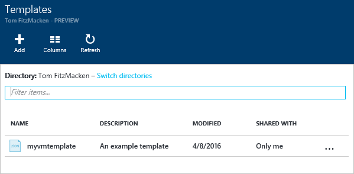

# Deploy resources with Resource Manager templates and Azure portal
> [!div class="op_single_selector"]
> * [PowerShell](resource-group-template-deploy.md)
> * [Azure CLI](resource-group-template-deploy-cli.md)
> * [Portal](resource-group-template-deploy-portal.md)
> * [REST API](resource-group-template-deploy-rest.md)
> 
> 

This topic shows how to use the [Azure portal](https://portal.azure.com) with [Azure Resource Manager](resource-group-overview.md) to deploy your Azure resources. To learn about managing your resources, see [Manage Azure resources through portal](resource-group-portal.md).

Currently, not every service supports the portal or Resource Manager. For those services, you need to use
the [classic portal](https://manage.windowsazure.com). For the status of each service, see [Azure portal availability chart](https://azure.microsoft.com/features/azure-portal/availability/).

## Create resource group
1. To create an empty resource group, select **New** > **Management** > **Resource Group**.
   
    
2. Give it a name and location, and, if necessary, select a subscription. You need to provide a location for the resource group because the resource group stores metadata about the resources. For compliance reasons, you may want to specify where that metadata is stored. In general, we recommend that you specify a location where most of your resources will reside. Using the same location can simplify your template.
   
    

## Deploy resources from Marketplace
After you create a resource group, you can deploy resources to it from the Marketplace. The Marketplace provides pre-defined solutions for common scenarios.

1. To start a deployment, select **New** and the type of resource you would like to deploy. Then, look for the particular version of the resource you would like to deploy.
   
    
2. If you do not see the particular solution you would like to deploy, you can search the Marketplace for it.
   
    
3. Depending on the type of selected resource, you have a collection of relevant properties to set before deployment. Those options are not shown here, as they vary based on resource type. For all types, you must select a destination resource group. The following image shows how to create a web app and deploy it to the resource group you created.
   
    
   
    Alternatively, you can decide to create a resource group when deploying your resources. Select **Create new** and give the resource group a name.
   
    
4. Your deployment begins. The deployment could take a few minutes. When the deployment has finished, you see a notification.
   
    
5. After deploying your resources, you can add more resources to the resource group by using the **Add** command on the resource group blade.
   
    

## Deploy resources from custom template
If you want to execute a deployment but not use any of the templates in the Marketplace, you can create a customized template that defines the infrastructure for your solution. To learn about creating templates, see [Authoring Azure Resource Manager templates](resource-group-authoring-templates.md).

1. To deploy a customized template through the portal, select **New**, and start searching for **Template Deployment** until you can select it from the options.
   
    
2. Select **Template Deployment** from the available resources.
   
    
3. After launching the template deployment, open the blank template that is available for customizing.
   
    
   
    In the editor, add the JSON syntax that defines the resources you want to deploy. Select **Save** when done. For guidance on writing the JSON syntax, see [Resource Manager template walkthrough](resource-manager-template-walkthrough.md).
   
    
4. Or, you can select a pre-existing template from the [Azure quickstart templates](https://azure.microsoft.com/documentation/templates/). These templates are contributed by the community. They cover many common scenarios, and someone may have added a template that is similar to what you are trying to deploy. You can search the templates to find something that matches your scenario.
   
    
   
    You can view the selected template in the editor.
5. After providing all the other values, select **Create** to deploy the template. 
   
    

## Deploy resources from a template saved to your account
The portal enables you to save a template to your Azure account, and redeploy it later. For more information about working with these saved templates, [Get started with private templates on the Azure portal](../marketplace-consumer/mytemplates-getstarted.md).

1. To find your saved templates, select **Browse** > **Templates**.
   
    
2. From the list of templates saved to your account, select the one you wish to work on.
   
    
3. Select **Deploy** to redeploy this saved template.
   
    

## Next Steps
* To view audit logs, see [Audit operations with Resource Manager](resource-group-audit.md).
* To troubleshoot deployment errors, see [View deployment operations](resource-manager-deployment-operations.md).
* To retrieve a template from a deployment or resource group, see [Export Azure Resource Manager template from existing resources](resource-manager-export-template.md).
* For guidance on how enterprises can use Resource Manager to effectively manage subscriptions, see [Azure enterprise scaffold - prescriptive subscription governance](resource-manager-subscription-governance.md).
* For a four part series about automating deployment, see [Automating application deployments to Azure Virtual Machines](../virtual-machines/windows/dotnet-core-1-landing.md?toc=%2fazure%2fvirtual-machines%2fwindows%2ftoc.json). This series covers application architecture, access and security, availability and scale, and application deployment.

