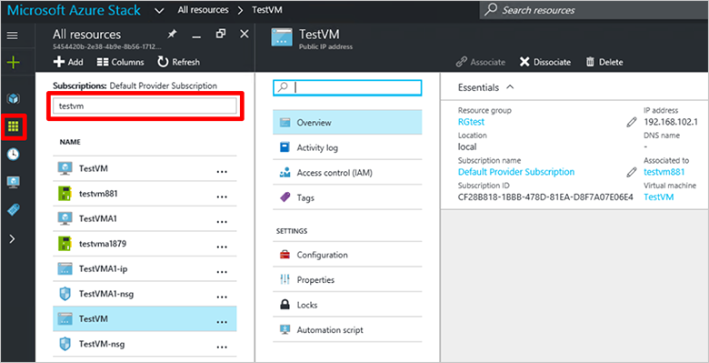

# Create a test virtual machine in Azure Stack
As an administrator, you can create a test virtual machine to validate your Azure Stack deployment.

> [!NOTE]
> Before you can provision virtual machines, you must [add the Windows Server 2016 Evaluation image to the Azure Stack marketplace](azure-stack-add-default-image.md).
> 
> 

## Create a virtual machine
1. On the Azure Stack POC computer, sign in to `https://adminportal.local.azurestack.external` as [an admin](azure-stack-connect-azure-stack.md), and then click **New** > **Virtual machines** > **Windows Server 2016 Datacenter Eval**.  

2. In the **Basics** blade, type a **Name**, **User name**, and **Password**. For **VM disk type**, choose **HDD**. Choose a **Subscription**. Create a **Resource group**, or select an existing one, and then click **OK**.  
3. In the **Choose a size** blade, click **A1 Basic**, and then click **Select**.  
4. In the **Settings** blade, click **Virtual network**. In the **Choose virtual network** blade, click **Create new**. In the **Create virtual network** blade, accept all the defaults, and click **OK**. In the **Settings** blade, click **OK**.

   
5. In the **Summary** blade, click **OK** to create the virtual machine.  
6. To see your new virtual machine, click **All resources**, then search for the virtual machine and click its name.

    

## Next steps
[Using the administrator and user portals in Azure Stack](azure-stack-manage-portals.md)
