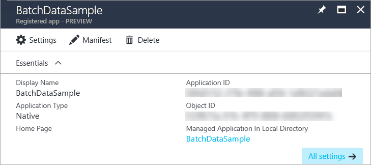
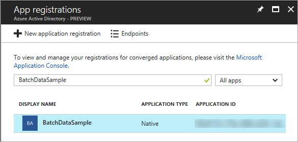
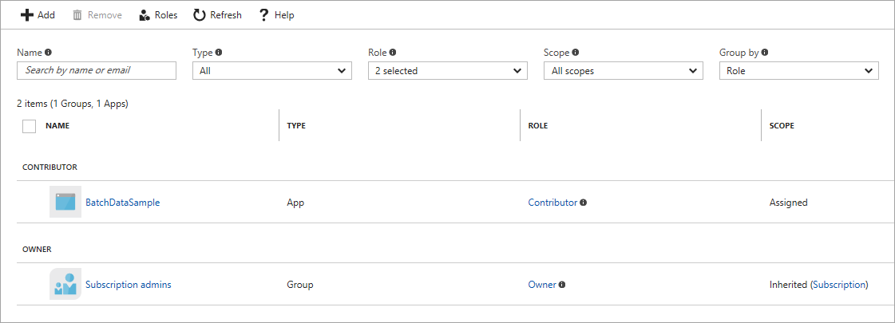

# Authenticate Batch service solutions with Active Directory

Azure Batch supports authentication with [Azure Active Directory][aad_about] (Azure AD). Azure AD is Microsoft’s multi-tenant cloud based directory and identity management service. Azure itself uses Azure AD to authenticate its customers, service administrators, and organizational users.

When using Azure AD authentication with Azure Batch, you can authenticate in one of two ways:

- By using **integrated authentication** to authenticate a user that is interacting with the application. An application using integrated authentication gathers a user's credentials and uses those credentials to authenticate access to Batch resources.
- By using a **service principal** to authenticate an unattended application. A service principal defines the policy and permissions for an application in order to represent the application when accessing resources at runtime.

To learn more about Azure AD, see the [Azure Active Directory Documentation](https://docs.microsoft.com/azure/active-directory/).

## Authentication and pool allocation mode

When you create a Batch account, you can specify where pools created for that account should be allocated. You can choose to allocate pools either in the default Batch service subscription or in a user subscription. Your choice affects how you authenticate access to resources in that account.

- **Batch service subscription**. By default, Batch pools are allocated in a Batch service subscription. If you choose this option, you can authenticate access to resources in that account either with [Shared Key](https://docs.microsoft.com/rest/api/batchservice/authenticate-requests-to-the-azure-batch-service) or with Azure AD.
- **User subscription.** You can choose to allocate Batch pools in a user subscription that you specify. If you choose this option, you must authenticate with Azure AD.

## Endpoints for authentication

To authenticate Batch applications with Azure AD, you need to include some well-known endpoints in your code.

### Azure AD endpoint

The base Azure AD authority endpoint is:

`https://login.microsoftonline.com/`

To authenticate with Azure AD, you use this endpoint together with the tenant ID (directory ID). The tenant ID identifies the Azure AD tenant to use for authentication. To retrieve the tenant ID, follow the steps outlined in [Get the tenant ID for your Azure Active Directory](#get-the-tenant-id-for-your-active-directory):

`https://login.microsoftonline.com/<tenant-id>`

> [!NOTE] 
> The tenant-specific endpoint is required when you authenticate using a service principal. 
> 
> The tenant-specific endpoint is optional when you authenticate using integrated authentication, but recommended. However, you can also use the Azure AD common endpoint. The common endpoint provides a generic credential gathering interface when a specific tenant is not provided. The common endpoint is `https://login.microsoftonline.com/common`.
>
>

For more information about Azure AD endpoints, see [Authentication Scenarios for Azure AD][aad_auth_scenarios].

### Batch resource endpoint

Use the **Azure Batch resource endpoint** to acquire a token for authenticating requests to the Batch service:

`https://batch.core.windows.net/`

## Register your application with a tenant

The first step in using Azure AD to authenticate is registering your application in an Azure AD tenant. Registering your application enables you to call the Azure [Active Directory Authentication Library][aad_adal] (ADAL) from your code. The ADAL provides an API for authenticating with Azure AD from your application. Registering your application is required whether you plan to use integrated authentication or a service principal.

When you register your application, you supply information about your application to Azure AD. Azure AD then provides an application ID that you use to associate your application with Azure AD at runtime. To learn more about the application ID, see [Application and service principal objects in Azure Active Directory](../active-directory/develop/active-directory-application-objects.md).

To register your Batch application, follow the steps in the [Adding an Application](../active-directory/develop/active-directory-integrating-applications.md#adding-an-application) section in [Integrating applications with Azure Active Directory][aad_integrate]. If you register your application as a Native Application, you can specify any valid URI for the **Redirect URI**. It does not need to be a real endpoint.

After you've registered your application, you'll see the application ID:



For more information about registering an application with Azure AD, see [Authentication Scenarios for Azure AD](../active-directory/develop/active-directory-authentication-scenarios.md).

## Get the tenant ID for your Active Directory

The tenant ID identifies the Azure AD tenant that provides authentication services to your application. To get the tenant ID, follow these steps:

1. In the Azure portal, select your Active Directory.
2. Click **Properties**.
3. Copy the GUID value provided for the directory ID. This value is also called the tenant ID.


## Use integrated authentication

To authenticate with integrated authentication, you need to grant your application permissions to connect to the Batch service API. This step enables your application to authenticate calls to the Batch service API with Azure AD.

Once you've [registered your application](#register-your-application-with-an-azure-ad-tenant), follow these steps in the Azure portal to grant it access to the Batch service:

1. In the left-hand navigation pane of the Azure portal, choose **More Services**, click **App Registrations**.
2. Search for the name of your application in the list of app registrations:

    

3. Open the **Settings** blade for your application. In the **API Access** section, select **Required permissions**.
4. In the **Required permissions** blade, click the **Add** button.
5. In step 1, search for the Batch API. Search for each of these strings until you find the API:
    1. **MicrosoftAzureBatch**.
    2. **Microsoft Azure Batch**. Newer Azure AD tenants may use this name.
    3. **ddbf3205-c6bd-46ae-8127-60eb93363864** is the ID for the Batch API. 
6. Once you find the Batch API, select it and click the **Select** button.
6. In step 2, select the check box next to **Access Azure Batch Service** and click the **Select** button.
7. Click the **Done** button.

The **Required Permissions** blade now shows that your Azure AD application has access to both ADAL and the Batch service API. Permissions are granted to ADAL automatically when you first register your app with Azure AD.


## Use a service principal 

To authenticate an application that runs unattended, you use a service principal. After you've registered your application, follow these steps in the Azure portal to configure a service principal:

1. Request a secret key for your application.
2. Assign an RBAC role to your application.

### Request a secret key for your application

When your application authenticates with a service principal, it sends both the application ID and a secret key to Azure AD. You'll need to create and copy the secret key to use from your code.

Follow these steps in the Azure portal:

1. In the left-hand navigation pane of the Azure portal, choose **More Services**, click **App Registrations**.
2. Search for the name of your application in the list of app registrations.
3. Display the **Settings** blade. In the **API Access** section, select **Keys**.
4. To create a key, enter a description for the key. Then select a duration for the key of either one or two years. 
5. Click the **Save** button to create and display the key. Copy the key value to a safe place, as you won't be able to access it again after you leave the blade. 

    

### Assign an RBAC role to your application

To authenticate with a service principal, you need to assign an RBAC role to your application. Follow these steps:

1. In the Azure portal, navigate to the Batch account used by your application.
2. In the **Settings** blade for the Batch account, select **Access Control (IAM)**.
3. Click the **Add** button. 
4. From the **Role** drop-down, choose either the _Contributor_ or _Reader_ role for your application. For more information on these roles, see [Get started with Role-Based Access Control in the Azure portal](../active-directory/role-based-access-control-what-is.md).  
5. In the **Select** field, enter the name of your application. Select your application from the list, and click **Save**.

Your application should now appear in your access control settings with an RBAC role assigned. 



### Get the tenant ID for your Azure Active Directory

The tenant ID identifies the Azure AD tenant that provides authentication services to your application. To get the tenant ID, follow these steps:

1. In the Azure portal, select your Active Directory.
2. Click **Properties**.
3. Copy the GUID value provided for the directory ID. This value is also called the tenant ID.


## Code examples

The code examples in this section show how to authenticate with Azure AD using integrated authentication and with a service principal. These code examples use .NET, but the concepts are similar for other languages.

> [!NOTE]
> An Azure AD authentication token expires after one hour. When using a long-lived **BatchClient** object, we recommend that you retrieve a token from ADAL on every request to ensure you always have a valid token. 
>
>
> To achieve this in .NET, write a method that retrieves the token from Azure AD and pass that method to a **BatchTokenCredentials** object as a delegate. The delegate method is called on every request to the Batch service to ensure that a valid token is provided. By default ADAL caches tokens, so a new token is retrieved from Azure AD only when necessary. For more information about tokens in Azure AD, see [Authentication Scenarios for Azure AD][aad_auth_scenarios].
>
>

### Code example: Using Azure AD integrated authentication with Batch .NET

To authenticate with integrated authentication from Batch .NET, reference the [Azure Batch .NET](https://www.nuget.org/packages/Azure.Batch/) package and the [ADAL](https://www.nuget.org/packages/Microsoft.IdentityModel.Clients.ActiveDirectory/) package.

Include the following `using` statements in your code:

```csharp
using Microsoft.Azure.Batch;
using Microsoft.Azure.Batch.Auth;
using Microsoft.IdentityModel.Clients.ActiveDirectory;
```

Reference the Azure AD endpoint in your code, including the tenant ID. To retrieve the tenant ID, follow the steps outlined in [Get the tenant ID for your Azure Active Directory](#get-the-tenant-id-for-your-active-directory):

```csharp
private const string AuthorityUri = "https://login.microsoftonline.com/<tenant-id>";
```

Reference the Batch service resource endpoint:

```csharp
private const string BatchResourceUri = "https://batch.core.windows.net/";
```

Reference your Batch account:

```csharp
private const string BatchAccountUrl = "https://myaccount.mylocation.batch.azure.com";
```

Specify the application ID (client ID) for your application. The application ID is available from your app registration in the Azure portal:

```csharp
private const string ClientId = "<application-id>";
```

Also copy the redirect URI that you specified during the registration process. The redirect URI specified in your code must match the redirect URI that you provided when you registered the application:

```csharp
private const string RedirectUri = "http://mybatchdatasample";
```

Write a callback method to acquire the authentication token from Azure AD. The **GetAuthenticationTokenAsync** callback method shown here calls ADAL to authenticate a user who is interacting with the application. The **AcquireTokenAsync** method provided by ADAL prompts the user for their credentials, and the application proceeds once the user provides them (unless it has already cached credentials):

```csharp
public static async Task<string> GetAuthenticationTokenAsync()
{
    var authContext = new AuthenticationContext(AuthorityUri);

    // Acquire the authentication token from Azure AD.
    var authResult = await authContext.AcquireTokenAsync(BatchResourceUri, 
                                                        ClientId, 
                                                        new Uri(RedirectUri), 
                                                        new PlatformParameters(PromptBehavior.Auto));

    return authResult.AccessToken;
}
```

Construct a **BatchTokenCredentials** object that takes the delegate as a parameter. Use those credentials to open a **BatchClient** object. You can use that **BatchClient** object for subsequent operations against the Batch service:

```csharp
public static async Task PerformBatchOperations()
{
    Func<Task<string>> tokenProvider = () => GetAuthenticationTokenAsync();

    using (var client = await BatchClient.OpenAsync(new BatchTokenCredentials(BatchAccountUrl, tokenProvider)))
    {
        await client.JobOperations.ListJobs().ToListAsync();
    }
}
```

### Code example: Using an Azure AD service principal with Batch .NET

To authenticate with a service principal from Batch .NET, reference the [Azure Batch .NET](https://www.nuget.org/packages/Azure.Batch/) package and the [ADAL](https://www.nuget.org/packages/Microsoft.IdentityModel.Clients.ActiveDirectory/) package.

Include the following `using` statements in your code:

```csharp
using Microsoft.Azure.Batch;
using Microsoft.Azure.Batch.Auth;
using Microsoft.IdentityModel.Clients.ActiveDirectory;
```

Reference the Azure AD endpoint in your code, including the tenant ID. When using a service principal, you must provide a tenant-specific endpoint. To retrieve the tenant ID, follow the steps outlined in [Get the tenant ID for your Azure Active Directory](#get-the-tenant-id-for-your-active-directory):

```csharp
private const string AuthorityUri = "https://login.microsoftonline.com/<tenant-id>";
```

Reference the Batch service resource endpoint:  

```csharp
private const string BatchResourceUri = "https://batch.core.windows.net/";
```

Reference your Batch account:

```csharp
private const string BatchAccountUrl = "https://myaccount.mylocation.batch.azure.com";
```

Specify the application ID (client ID) for your application. The application ID is available from your app registration in the Azure portal:

```csharp
private const string ClientId = "<application-id>";
```

Specify the secret key that you copied from the Azure portal:

```csharp
private const string ClientKey = "<secret-key>";
```

Write a callback method to acquire the authentication token from Azure AD. The **GetAuthenticationTokenAsync** callback method shown here calls ADAL for unattended authentication:

```csharp
public static async Task<string> GetAuthenticationTokenAsync()
{
    AuthenticationContext authContext = new AuthenticationContext(AuthorityUri);
    AuthenticationResult authResult = await authContext.AcquireTokenAsync(BatchResourceUri, new ClientCredential(ClientId, ClientKey));

    return authResult.AccessToken;
}
```

Construct a **BatchTokenCredentials** object that takes the delegate as a parameter. Use those credentials to open a **BatchClient** object. You can then use that **BatchClient** object for subsequent operations against the Batch service:

```csharp
public static async Task PerformBatchOperations()
{
    Func<Task<string>> tokenProvider = () => GetAuthenticationTokenAsync();

    using (var client = await BatchClient.OpenAsync(new BatchTokenCredentials(BatchAccountUrl, tokenProvider)))
    {
        await client.JobOperations.ListJobs().ToListAsync();
    }
}
```

## Next steps

To learn more about Azure AD, see the [Azure Active Directory Documentation](https://docs.microsoft.com/azure/active-directory/). In-depth examples showing how to use ADAL are available in the [Azure Code Samples](https://azure.microsoft.com/resources/samples/?service=active-directory) library.

To learn more about service principals, see [Application and service principal objects in Azure Active Directory](../active-directory/develop/active-directory-application-objects.md). To create a service principal using the Azure portal, see [Use portal to create Active Directory application and service principal that can access resources](../resource-group-create-service-principal-portal.md). You can also create a service principal with PowerShell or Azure CLI. 

To authenticate Batch Management applications using Azure AD, see [Authenticate Batch Management solutions with Active Directory](batch-aad-auth-management.md). 

[aad_about]: ../active-directory/active-directory-whatis.md "What is Azure Active Directory?"
[aad_adal]: ../active-directory/active-directory-authentication-libraries.md
[aad_auth_scenarios]: ../active-directory/active-directory-authentication-scenarios.md "Authentication Scenarios for Azure AD"
[aad_integrate]: ../active-directory/active-directory-integrating-applications.md "Integrating Applications with Azure Active Directory"
[azure_portal]: http://portal.azure.com
