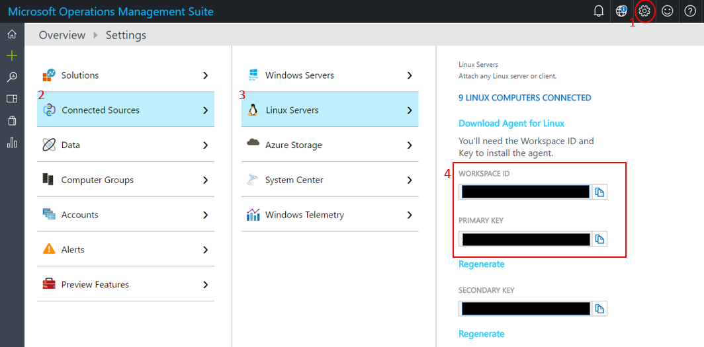

# Monitor an Azure Container Service cluster with Microsoft Operations Management Suite (OMS)

## Prerequisites
This walkthrough assumes that you have [created a Kubernetes cluster using Azure Container Service](container-service-kubernetes-walkthrough.md).

It also assumes that you have the `az` Azure cli and `kubectl` tools installed.

You can test if you have the `az` tool installed by running:

```console
$ az --version
```

If you don't have the `az` tool installed, there are instructions [here](https://github.com/azure/azure-cli#installation).

You can test if you have the `kubectl` tool installed by running:

```console
$ kubectl version
```

If you don't have `kubectl` installed, you can run:

```console
$ az acs kubernetes install-cli
```

## Monitoring Containers with Operations Management Suite (OMS)

Microsoft Operations Management (OMS) is Microsoft's cloud-based IT
management solution that helps you manage and protect your on-premises
and cloud infrastructure. Container Solution is a solution in OMS Log
Analytics, which helps you view the container inventory, performance,
and logs in a single location. You can audit, troubleshoot containers by
viewing the logs in centralized location, and find noisy consuming
excess container on a host.


For more information about Container Solution, please refer to the
[Container Solution Log
Analytics](../log-analytics/log-analytics-containers.md).

## Installing OMS on Kubernetes

### Obtain your workspace ID and key
For the OMS agent to talk to the service it needs to be configured with a workspace id and
a workspace key. To get the workspace id and key you need to create an OMS account at <https://mms.microsoft.com>.
Please follow the steps to create an account. Once you are done creating
the account, you need to obtain your id and key by clicking
**Settings**, then **Connected Sources**, and then **Linux Servers**, as shown below.

 

### Install the OMS agent using a DaemonSet
DaemonSets are used by Kubernetes to run a single instance of a container on each host in the cluster.
They're perfect for running monitoring agents.

Here is the [DaemonSet YAML file](https://github.com/Microsoft/OMS-docker/tree/master/Kubernetes). Save it to a file named `oms-daemonset.yaml` and
replace the place-holder values for `WSID` and `KEY` with your workspace id and key in the file.

Once you have added your workspace ID and key to the DaemonSet configuration, you can install the OMS agent
on your cluster with the `kubectl` command line tool:

```console
$ kubectl create -f oms-daemonset.yaml
```

### Conclusion
That's it! After a few minutes, you should be able to see data flowing to your OMS dashboard.
