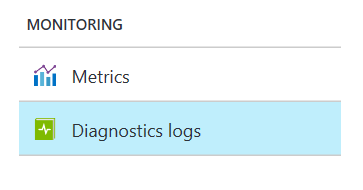
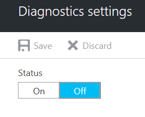

# Event Hubs diagnostic logs

You can view two types of logs for Azure Event Hubs:
* **[Activity logs](../monitoring-and-diagnostics/monitoring-overview-activity-logs.md)**. These logs have information about operations performed on a job. The logs are always enabled.
* **[Diagnostic logs](../monitoring-and-diagnostics/monitoring-overview-of-diagnostic-logs.md)**. You can configure diagnostic logs, for a richer view into everything that happens with a job. Diagnostic logs cover activities from the time the job is created until the job is deleted, including updates and activities that occur while the job is running.

## Turn on diagnostic logs
Diagnostics logs are **off** by default. To enable diagnostic logs:

1.	In the Azure portal, go to the streaming job blade.

2.	Under **Monitoring**, go to the **Diagnostics logs** blade.

	  

3.	Select **Turn on diagnostics**.

	

4.	For **Status**, select **On**.

	

5.	Set the archive target that you want; for example, a storage account, an event hub, or Azure Log Analytics.

6.	Select the categories of logs that you want to collect; for example, **Execution** or **Authoring**.

7.	Save the new diagnostics settings.

New settings take effect in about 10 minutes. After that, logs appear in the configured archival target, on the **Diagnostics logs** blade.

For more information about configuring diagnostics, see the [overview of Azure diagnostic logs](../monitoring-and-diagnostics/monitoring-overview-of-diagnostic-logs.md).

## Diagnostic logs categories
Event Hubs captures diagnostic logs for two categories:

* **ArchivalLogs**: logs related to Event Hubs archives, specifically, logs related to archive errors.
* **OperationalLogs** information about what is happening during Event Hubs operations, specifically, the operation type, including event hub creation, resources used, and the status of the operation.

## Diagnostic logs schema
All logs are stored in JavaScript Object Notation (JSON) format. Each entry has string fields that use the format described in the following examples.

### Archive logs schema

Archive log JSON strings include elements listed in the following table:

Name | Description
------- | -------
TaskName | Description of the task that failed.
ActivityId | Internal ID, used for tracking.
trackingId | Internal ID, used for tracking.
resourceId | Azure Resource Manager resource ID.
eventHub | Event hub full name (includes namespace name).
partitionId | Event Hub partition being written to.
archiveStep | ArchiveFlushWriter
startTime | Failure start time.
failures | Number of times failure occurred.
durationInSeconds | Duration of failure.
message | Error message.
category | ArchiveLogs

The following is an example of an archive log JSON string:

```json
{
	 "TaskName": "EventHubArchiveUserError",
	 "ActivityId": "21b89a0b-8095-471a-9db8-d151d74ecf26",
	 "trackingId": "21b89a0b-8095-471a-9db8-d151d74ecf26_B7",
	 "resourceId": "/SUBSCRIPTIONS/854D368F-1828-428F-8F3C-F2AFFA9B2F7D/RESOURCEGROUPS/DEFAULT-EVENTHUB-CENTRALUS/PROVIDERS/MICROSOFT.EVENTHUB/NAMESPACES/FBETTATI-OPERA-EVENTHUB",
	 "eventHub": "fbettati-opera-eventhub:eventhub:eh123~32766",
	 "partitionId": "1",
	 "archiveStep": "ArchiveFlushWriter",
	 "startTime": "9/22/2016 5:11:21 AM",
	 "failures": 3,
	 "durationInSeconds": 360,
	 "message": "Microsoft.WindowsAzure.Storage.StorageException: The remote server returned an error: (404) Not Found. ---> System.Net.WebException: The remote server returned an error: (404) Not Found.\r\n   at Microsoft.WindowsAzure.Storage.Shared.Protocol.HttpResponseParsers.ProcessExpectedStatusCodeNoException[T](HttpStatusCode expectedStatusCode, HttpStatusCode actualStatusCode, T retVal, StorageCommandBase`1 cmd, Exception ex)\r\n   at Microsoft.WindowsAzure.Storage.Blob.CloudBlockBlob.<PutBlockImpl>b__3e(RESTCommand`1 cmd, HttpWebResponse resp, Exception ex, OperationContext ctx)\r\n   at Microsoft.WindowsAzure.Storage.Core.Executor.Executor.EndGetResponse[T](IAsyncResult getResponseResult)\r\n   --- End of inner exception stack trace ---\r\n   at Microsoft.WindowsAzure.Storage.Core.Util.StorageAsyncResult`1.End()\r\n   at Microsoft.WindowsAzure.Storage.Core.Util.AsyncExtensions.<>c__DisplayClass4.<CreateCallbackVoid>b__3(IAsyncResult ar)\r\n--- End of stack trace from previous location where exception was thrown ---\r\n   at System.",
	 "category": "ArchiveLogs"
}
```

### Operation logs schema

Operation log JSON strings include elements listed in the following table:

Name | Description
------- | -------
ActivityId | Internal ID, used to track purpose.
EventName | Operation name.	 
resourceId | Azure Resource Manager resource ID.
SubscriptionId | Subscription ID.
EventTimeString | Operation time.
EventProperties | Operation properties.
Status | Operation status.
Caller | Caller of operation (Azure portal or management client).
category | OperationalLogs

The following is an example of an operation log JSON string:

```json
Example:
{
	 "ActivityId": "6aa994ac-b56e-4292-8448-0767a5657cc7",
	 "EventName": "Create EventHub",
	 "resourceId": "/SUBSCRIPTIONS/1A2109E3-9DA0-455B-B937-E35E36C1163C/RESOURCEGROUPS/DEFAULT-SERVICEBUS-CENTRALUS/PROVIDERS/MICROSOFT.EVENTHUB/NAMESPACES/SHOEBOXEHNS-CY4001",
	 "SubscriptionId": "1a2109e3-9da0-455b-b937-e35e36c1163c",
	 "EventTimeString": "9/28/2016 8:40:06 PM +00:00",
	 "EventProperties": "{\"SubscriptionId\":\"1a2109e3-9da0-455b-b937-e35e36c1163c\",\"Namespace\":\"shoeboxehns-cy4001\",\"Via\":\"https://shoeboxehns-cy4001.servicebus.windows.net/f8096791adb448579ee83d30e006a13e/?api-version=2016-07\",\"TrackingId\":\"5ee74c9e-72b5-4e98-97c4-08a62e56e221_G1\"}",
	 "Status": "Succeeded",
	 "Caller": "ServiceBus Client",
	 "category": "OperationalLogs"
}
```

## Next steps
* [Introduction to Event Hubs](event-hubs-what-is-event-hubs.md)
* [Event Hubs API overview](event-hubs-api-overview.md)
* [Get started with Event Hubs](event-hubs-csharp-ephcs-getstarted.md)
