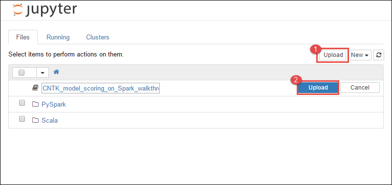

# Use Microsoft Cognitive Toolkit deep learning model with Azure HDInsight Spark cluster

In this article, you do the following steps.

1. Run a custom script to install Microsoft Cognitive Toolkit on an Azure HDInsight Spark cluster.

2. Upload a Jupyter notebook to the Spark cluster to see how to apply a trained Microsoft Cognitive Toolkit deep learning model to files in an Azure Blob Storage Account using the [Spark Python API (PySpark)](https://spark.apache.org/docs/0.9.0/python-programming-guide.html)

## Prerequisites

* **An Azure subscription**. Before you begin this tutorial, you must have an Azure subscription. See [Create your free Azure account today](https://azure.microsoft.com/free).

* **Azure HDInsight Spark cluster**. For this article, create a Spark 2.0 cluster. For instructions, see [Create Apache Spark cluster in Azure HDInsight](hdinsight-apache-spark-jupyter-spark-sql.md).

## How does this solution flow?

This solution is divided between this article and a Jupyter notebook that you upload as part of this tutorial. In this article, you complete the following steps:

* Run a script action on an HDInsight Spark cluster to install Microsoft Cognitive Toolkit and Python packages.
* Upload the Jupyter notebook that runs the solution to the HDInsight Spark cluster.

The following remaining steps are covered in the Jupyter notebook.

- Load sample images into a Spark Resiliant Distributed Dataset or RDD
   - Load modules and define presets
   - Download the dataset locally on the Spark cluster
   - Convert the dataset into an RDD
- Score the images using a trained Cognitive Toolkit model
   - Download the trained Cognitive Toolkit model to the Spark cluster
   - Define functions to be used by worker nodes
   - Score the images on worker nodes
   - Evaluate model accuracy

## Install Microsoft Cognitive Toolkit

You can install Microsoft Cognitive Toolkit on a Spark cluster using script action. Script action uses custom scripts to install components on the cluster that are not available by default. You can use the custom script from the Azure Portal, by using HDInsight .NET SDK, or by using Azure PowerShell. You can also use the script to install the toolkit either as part of cluster creation, or after the cluster is up and running. 

In this article, we use the portal to install the toolkit, after the cluster has been created. For other ways to run the custom script, see [Customize HDInsight clusters using Script Action](hdinsight-hadoop-customize-cluster-linux.md).

### Using the Azure Portal

For instructions on how to use the Azure Portal to run script action, see [Customize HDInsight clusters using Script Action](hdinsight-hadoop-customize-cluster-linux.md#use-a-script-action-during-cluster-creation). Make sure you provide the following inputs to install Microsoft Cognitive Toolkit.

* Provide a value for the script action name.

* For **Bash script URI**, enter `https://raw.githubusercontent.com/Azure-Samples/hdinsight-pyspark-cntk-integration/master/cntk-install.sh`.

* Make sure you run the script only on the head and worker nodes and clear all the other checkboxes.

* Click **Create**.

## Upload the Jupyter notebook to Azure HDInsight Spark cluster

To use the Microsoft Cognitive Toolkit with the Azure HDInsight Spark cluster, you must load the Jupyter notebook **CNTK_model_scoring_on_Spark_walkthrough.ipynb** to the Azure HDInsight Spark cluster. This notebook is available on GitHub at [https://github.com/Azure-Samples/hdinsight-pyspark-cntk-integration](https://github.com/Azure-Samples/hdinsight-pyspark-cntk-integration).

1. Clone the GitHub repository [https://github.com/Azure-Samples/hdinsight-pyspark-cntk-integration](https://github.com/Azure-Samples/hdinsight-pyspark-cntk-integration). For instructions to clone, see [Cloning a repository](https://help.github.com/articles/cloning-a-repository/).

2. From the Azure Portal, open the Spark cluster blade that you already provisioned, click **Cluster Dashboard**, and then click **Jupyter notebook**.

	You can also launch the Jupyter notebook by going to the URL `https://<clustername>.azurehdinsight.net/jupyter/`. Replace \<clustername> with the name of your HDInsight cluster.

3. From the Jupyter notebook, click **Upload** in the top-right corner and then navigate to the location where you cloned the GitHub repository.

	

4. Click **Upload** again.

5. After the notebook is uploaded, click the name of the notebook and then follow the instructions in the notebook itself on how to load the data set and perform the tutorial.

## See also
* [Overview: Apache Spark on Azure HDInsight](hdinsight-apache-spark-overview.md)

### Scenarios
* [Spark with BI: Perform interactive data analysis using Spark in HDInsight with BI tools](hdinsight-apache-spark-use-bi-tools.md)
* [Spark with Machine Learning: Use Spark in HDInsight for analyzing building temperature using HVAC data](hdinsight-apache-spark-ipython-notebook-machine-learning.md)
* [Spark with Machine Learning: Use Spark in HDInsight to predict food inspection results](hdinsight-apache-spark-machine-learning-mllib-ipython.md)
* [Spark Streaming: Use Spark in HDInsight for building real-time streaming applications](hdinsight-apache-spark-eventhub-streaming.md)
* [Website log analysis using Spark in HDInsight](hdinsight-apache-spark-custom-library-website-log-analysis.md)
* [Application Insight telemetry data analysis using Spark in HDInsight](hdinsight-spark-analyze-application-insight-logs.md)

### Create and run applications
* [Create a standalone application using Scala](hdinsight-apache-spark-create-standalone-application.md)
* [Run jobs remotely on a Spark cluster using Livy](hdinsight-apache-spark-livy-rest-interface.md)

### Tools and extensions
* [Use HDInsight Tools Plugin for IntelliJ IDEA to create and submit Spark Scala applications](hdinsight-apache-spark-intellij-tool-plugin.md)
* [Use HDInsight Tools Plugin for IntelliJ IDEA to debug Spark applications remotely](hdinsight-apache-spark-intellij-tool-plugin-debug-jobs-remotely.md)
* [Use Zeppelin notebooks with a Spark cluster on HDInsight](hdinsight-apache-spark-zeppelin-notebook.md)
* [Kernels available for Jupyter notebook in Spark cluster for HDInsight](hdinsight-apache-spark-jupyter-notebook-kernels.md)
* [Use external packages with Jupyter notebooks](hdinsight-apache-spark-jupyter-notebook-use-external-packages.md)
* [Install Jupyter on your computer and connect to an HDInsight Spark cluster](hdinsight-apache-spark-jupyter-notebook-install-locally.md)

### Manage resources
* [Manage resources for the Apache Spark cluster in Azure HDInsight](hdinsight-apache-spark-resource-manager.md)
* [Track and debug jobs running on an Apache Spark cluster in HDInsight](hdinsight-apache-spark-job-debugging.md)

[hdinsight-versions]: hdinsight-component-versioning.md
[hdinsight-upload-data]: hdinsight-upload-data.md
[hdinsight-storage]: hdinsight-hadoop-use-blob-storage.md

[azure-purchase-options]: http://azure.microsoft.com/pricing/purchase-options/
[azure-member-offers]: http://azure.microsoft.com/pricing/member-offers/
[azure-free-trial]: http://azure.microsoft.com/pricing/free-trial/
[azure-create-storageaccount]: storage-create-storage-account.md
