# Monitor Azure SQL Database using Azure SQL Analytics (Preview) in Log Analytics


The Azure SQL Monitoring solution in Azure Log Analytics collects and visualizes important SQL Azure performance metrics. By using the metrics that you collect with the solution, you can create custom monitoring rules and alerts. And, you can monitor Azure SQL Database and elastic pool metrics across multiple Azure subscriptions and elastic pools and visualize them. The solution also helps you to identify issues at each layer of your application stack.  It uses [Azure Diagnostic metrics](log-analytics-azure-storage.md) together with Log Analytics views to present data about all your Azure SQL databases and elastic pools in a single Log Analytics workspace.

Currently, this preview solution supports up to 150,000 Azure SQL Databases and 5,000 SQL Elastic Pools per workspace.

The Azure SQL Monitoring solution, like others available for Log Analytics, helps you monitor and receive notifications about the health of your Azure resources—in this case, Azure SQL Database. Microsoft Azure SQL Database is a scalable relational database service that provides familiar SQL-Server-like capabilities to applications running in the Azure cloud. Log Analytics helps you to collect, correlate, and visualize structured and unstructured data.

## Connected sources

The Azure SQL Monitoring solution doesn't use agents to connect to the Log Analytics service.

The following table describes the connected sources that are supported by this solution.

| Connected Source | Support | Description |
| --- | --- | --- |
| [Windows agents](log-analytics-windows-agents.md) | No | Direct Windows agents are not used by the solution. |
| [Linux agents](log-analytics-linux-agents.md) | No | Direct Linux agents are not used by the solution. |
| [SCOM management group](log-analytics-om-agents.md) | No | A direct connection from the SCOM agent to Log Analytics is not used by the solution. |
| [Azure storage account](log-analytics-azure-storage.md) | No | Log Analytics does not read the data from a storage account. |
| [Azure diagnostics](log-analytics-azure-storage.md) | Yes | Azure metric data is sent to Log Analytics directly by Azure. |

## Prerequisites

- An Azure Subscription. If you don't have one, you can create one for [free](https://azure.microsoft.com/free/).
- A Log Analytics workspace. You can use an existing one, or you can [create a new one](log-analytics-get-started.md) before you start using this solution.
- Enable Azure Diagnostics for your Azure SQL databases and elastic pools and [configure them to send their data to Log Analytics](https://blogs.technet.microsoft.com/msoms/2017/01/17/enable-azure-resource-metrics-logging-using-powershell/).

## Configuration

Perform the following steps to add the Azure SQL Monitoring solution to your workspace.

1. Add the Azure SQL Analytics solution to your workspace from [Azure marketplace](https://azuremarketplace.microsoft.com/en-us/marketplace/apps/Microsoft.AzureSQLAnalyticsOMS?tab=Overview) or by using the process described in [Add Log Analytics solutions from the Solutions Gallery](log-analytics-add-solutions.md).
2. In the Azure portal, click **New** (the + symbol), then in the list of resources, select **Monitoring + Management**.  
    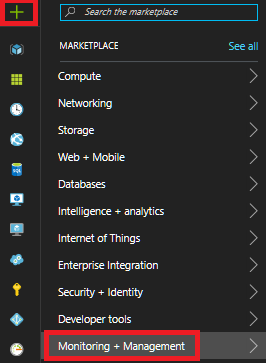
3. In the **Monitoring + Management** list click **See all**.
4. In the **Recommended** list, click **More** , and then in the new list, find **Azure SQL Analytics (Preview)** and then select it.  
    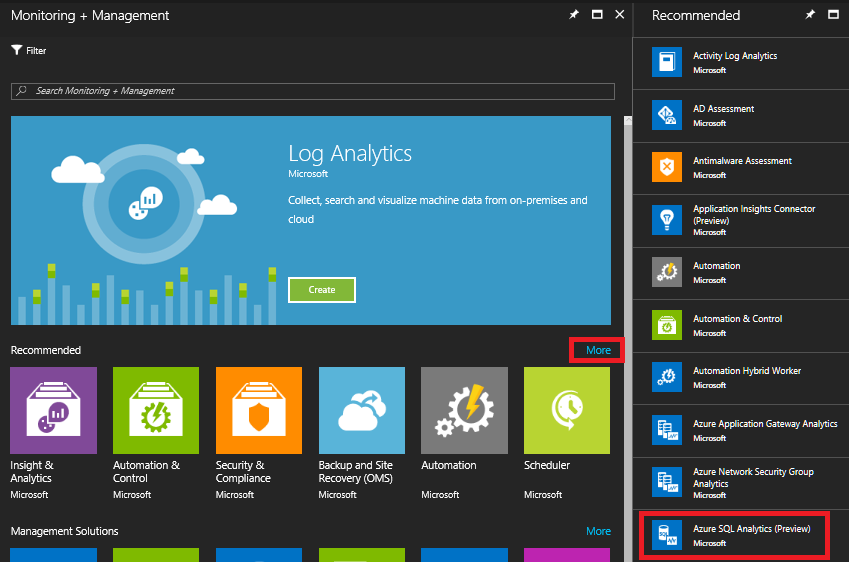
5. In the **Azure SQL Analytics (Preview)** blade, click **Create**.  
    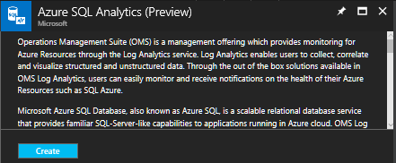
6. In the **Create new solution** blade, select the workspace that you want to add the solution to and then click **Create**.  
    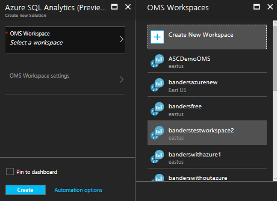


### To configure multiple Azure subscriptions

To support multiple subscriptions, use the PowerShell script from [Enable Azure resource metrics logging using PowerShell](https://blogs.technet.microsoft.com/msoms/2017/01/17/enable-azure-resource-metrics-logging-using-powershell/). Provide the workspace resource ID as a parameter when executing the script to send diagnostic data from resources in one Azure subscription to a workspace in another Azure subscription.

**Example**

```
PS C:\> $WSID = "/subscriptions/<subID>/resourcegroups/oms/providers/microsoft.operationalinsights/workspaces/omsws"
```

```
PS C:\> .\Enable-AzureRMDiagnostics.ps1 -WSID $WSID
```

## Using the solution

When you add the solution to your workspace, the Azure SQL Analytics tile is added to your workspace, and it appears in Overview. The tile shows the number of Azure SQL databases and Azure SQL elastic pools that the solution is connected to.

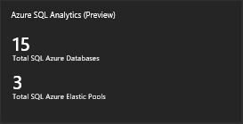

### Viewing Azure SQL Monitoring data

Click on the **Azure SQL Monitoring** tile to open the Azure SQL Analytics dashboard. The dashboard includes the columns in the following table. Each column lists up to ten items matching that column's criteria for the specified scope and time range. You can run a log search that returns all records by clicking **See all** at the bottom of the column or by clicking the column header.

Read about [SQL Database options and performance for service tiers](../sql-database/sql-database-service-tiers.md).


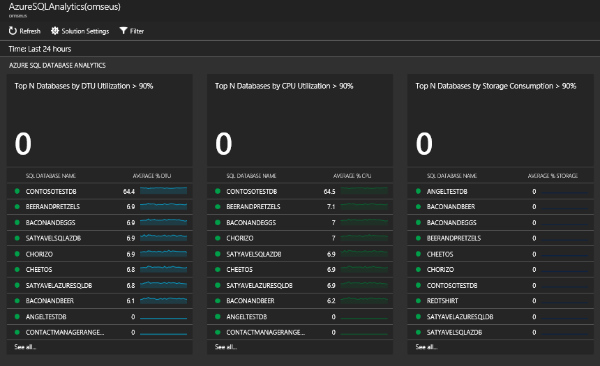


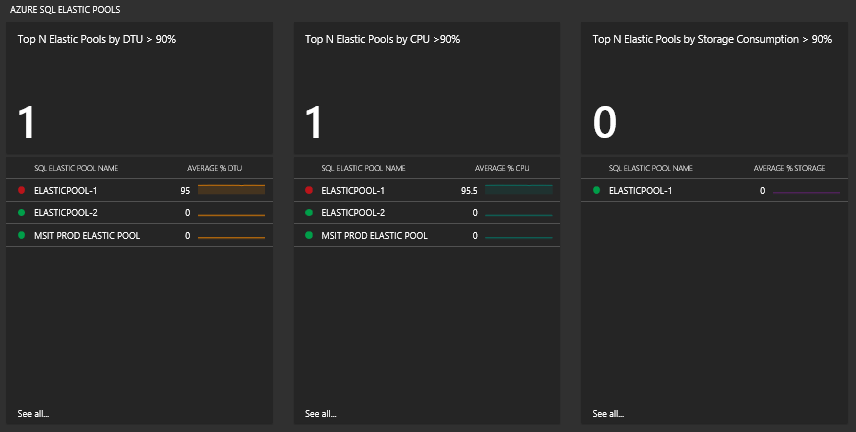

| Column | Description |
| --- | --- |
| **Azure SQL Database Analytics** | &nbsp; |
| Top N Databases by DTU Utilization &gt; 90% | This panel shows the number of Azure SQL databases that had DTU utilization over 90% for the time selected. The top tile shows the number of databases that have consumed more than 90% of total allocated DTU availability during the same specified time of all databases you are monitoring within Log Analytics.  Click on a database name to run a log search that shows a line chart comparing the database's DTU utilization compared to all others monitored by the workspace. |
| Top N Databases by CPU Utilization &gt; 90% | This panel shows the number of Azure SQL databases that had CPU utilization over 90% for the time selected. The top tile shows the number of databases that have consumed more than 90% of total allocated CPU availability during the same specified time of all databases you are monitoring within Log Analytics.  Click on a database name to run a log search that shows a line chart comparing the database's CPU utilization compared to all others monitored by the workspace. |
| Top N Databases by Storage Consumption &gt; 90% | This panel shows the number of Azure SQL databases that had consumed greater than 90% of their storage allocation for the time selected. The top tile shows the number of databases that have breached the threshold of 90% during the same specified time of all databases you are monitoring within Log Analytics.  Click on a database name to run a log search that shows a line chart comparing the database's storage consumption compared to all others monitored by the workspace. |
| **Azure SQL Elastic Pools** | &nbsp; |
| Top N Elastic Pools by DTU &gt; 90% | This panel shows the number of Azure SQL elastic pools that had consumed greater than 90% of their total DTU allocation for the time selected. The top tile shows the number of elastic pools that have breached the threshold of 90% during the same specified time of all Azure SQL elastic pools you are monitoring within Log Analytics.  Click on an elastic pool name to run a log search that shows a line chart comparing the elastic pool's storage consumption compared to all others monitored by the workspace. |
| Top N Elastic Pools by CPU &gt; 90% | This panel shows the number of Azure SQL elastic pools that had CPU utilization over 90% for the time period selected. The top tile shows the number of elastic pools that have breached the threshold of 90% during the same specified time of all Azure SQL elastic pools you are monitoring within Log Analytics.  Click on an elastic pool name to run a log search that shows a line chart comparing the elastic pool's CPU utilization compared to all others monitored by the workspace. |
| Top N Elastic Pools by Storage Consumption &gt; 90% | This panel shows the number of Azure SQL elastic pools that had consumed greater than 90% of their storage allocation for the time selected. The top tile shows the number of elastic pools that have breached the threshold of 90% during the same specified time of all elastic pools you are monitoring within Log Analytics.  Click on an elastic pool name to run a log search that shows a line chart comparing the elastic pool's storage consumption compared to all others monitored by the workspace. |
| **Azure SQL Activity Logs** | &nbsp; |
| SQL Azure Activity Audit | This panel shows the number of Azure activity records related to Azure SQL for the time selected. Click an item to run a log search that shows additional details about the item. |


### Analyze data and create alerts

The solution includes useful queries to help get you analyzing your data. If you scroll to the right, the dashboard will list several common queries that you can click on to perform a [log search](log-analytics-log-searches.md) for Azure SQL data.

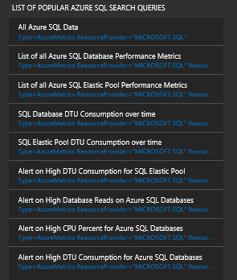

The solution includes some *alert-based queries*, as shown above that you can use to alert on specific thresholds for both Azure SQL databases and elastic pools.

#### To configure an alert for your workspace

1. Go to the [OMS portal](http://mms.microsoft.com/) and sign in.
2. Open the workspace that you have configured for the solution.
3. On the Overview page, click the **Azure SQL Analytics (Preview)** tile.
4. Scroll to the right and click a query to start creating an alert.  
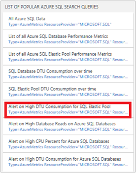
5. In Log Search, click **Alert**.  
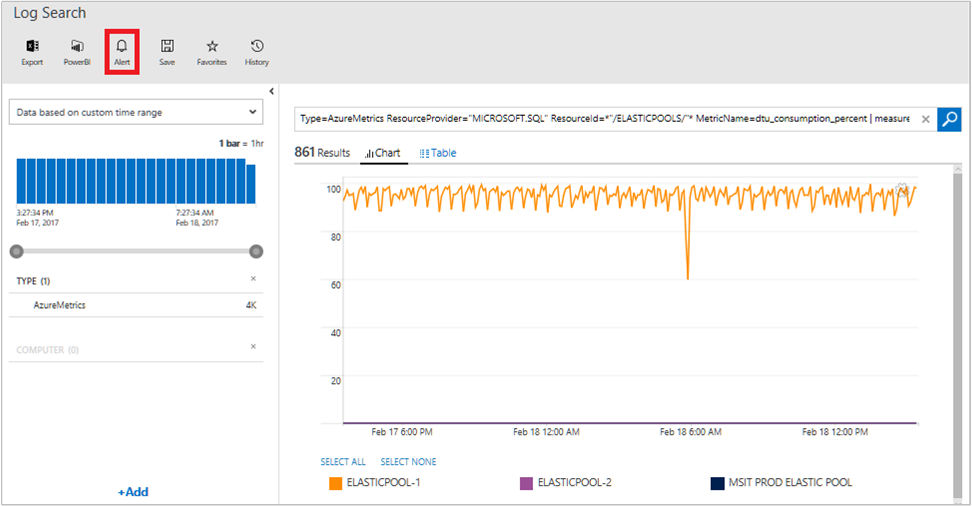
6. On the **Add Alert Rule** page, configure the appropriate properties and the specific thresholds that you want and then click **Save**.  
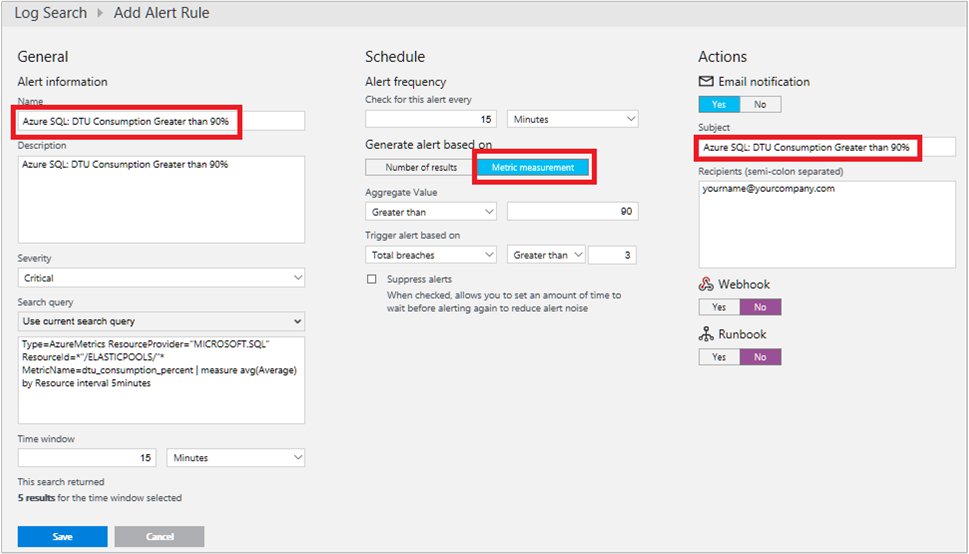

### Act on Azure SQL Monitoring data

As an example, one of the most useful queries that you can perform is to compare the DTU utilization for all Azure SQL Elastic Pools across all your Azure subscriptions. Database Throughput Unit (DTU) provides a way to describe the relative capacity of a performance level of Basic, Standard, and Premium databases and pools. DTUs are based on a blended measure of CPU, memory, reads, and writes. As DTUs increase, the power offered by the performance level increases. For example, a performance level with 5 DTUs has five times more power than a performance level with 1 DTU. A maximum DTU quota applies to each server and elastic pool.

By running the following Log Search query, you can easily tell if you are underutilizing or over utilizing your SQL Azure elastic pools.

```
Type=AzureMetrics ResourceId=*"/ELASTICPOOLS/"* MetricName=dtu_consumption_percent | measure avg(Average) by Resource | display LineChart
```

In the following example, you can see that one elastic pool has a high usage near 100% DTU while others have very little usage. You can investigate further to troubleshoot potential recent changes in your environment using Azure Activity logs.

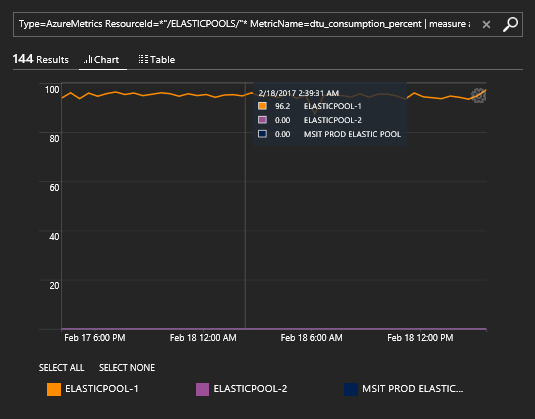

## See also

- Use [Log Searches](log-analytics-log-searches.md) in Log Analytics to view detailed Azure SQL data.
- [Create your own dashboards](log-analytics-dashboards.md) showing Azure SQL data.
- [Create alerts](log-analytics-alerts.md) when specific Azure SQL events occur.
