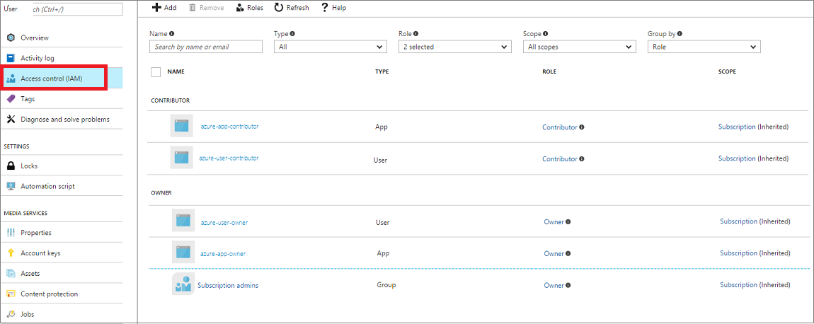
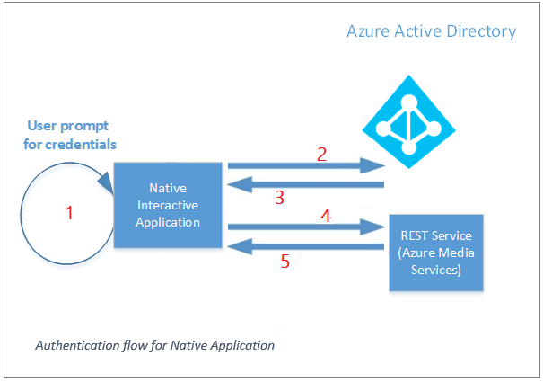
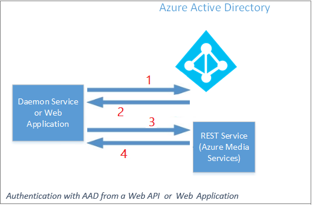

# Accessing Azure Media Services API with AAD authentication overview
 
The Azure Media Services API is a RESTful API, to perform operations on media resources, you can use REST API or available client SDKs. Azure Media Services  (AMS) provides Media Services client SDK for .NET. To be authorized to access AMS resources/API, you must first be authenticated. 

AMS supports Azure Active Directory [(AAD) based authentication](../active-directory/active-directory-whatis.md). The Azure Media REST service requires that the User or Application making REST API requests must have either **contributor** or **owner** level access to the resources. For more information, see [Get started with Role-Based Access Control in the Azure portal](../active-directory/role-based-access-control-what-is.md).  

>[!IMPORTANT]
>AMS currently supports ACS authentication model. However, ACS auth is going to be deprecated on June 1st, 2018. We recommend that you migrate to AAD authentication model as soon as possible.

This document gives an overview of how to access AMS API using REST or .NET APIs.

## Access control

For the Azure Media REST request to succeed, the calling user must be a "Contributor" or "Owner" of the AMS account it is trying to access.  
Only the "Owner" can give media resource (account) access to new Users or Apps. "Contributor" only gets to access the media resource.
Unauthorized requests will fail with status code 401. If you see this failure, double check that you have configured your user as "Contributor" or "Owner" on the Media Services account. You can check this through the Azure portal by searching for your media account and clicking on **Access control** tab. 

## Types of authentication 
 
When using AAD authentication with Azure Media Services, you can authenticate in one of two ways:

- **User authentication** is used to authenticate a person who is using the app to interact with AMS resources. The interactive application should first prompt the user for credentials. For example, a management console app used by authorized users to monitor encoding jobs or live streaming. 
- **Service principal authentication** is used to authenticate a service. Applications that commonly use this authentication method are apps that run daemon services, middle-tier services or scheduled jobs: Web Apps, Function Apps, Logic Apps, API, Microservice.

### User authentication 

Applications that should use this authentication method are management/monitoring native apps: Mobile Apps, Windows Apps, and Console applications. This type of solution is very useful when you want human interaction with the service that fits one of the following scenarios:

- Monitoring dashboard for your Encoding jobs.
- Monitoring dashboard for your Live Streams.
- Management application for desktop or mobile users to administer resources in a Media services account.

>[!NOTE]
>This authentication method should not be used for consumer facing applications. 

A native application has to first acquire an access token from AAD and then use it when making HTTP requests to the Media Services REST API. You add the access token to the request header. 

The following diagram shows a typical interactive application authentication flow. 

In the diagram above, the numbers represent the flow of the requests in chronological order:

>[!NOTE]
>When the user authentication method is used, all apps share the same (default) "native application Client ID" and "native application redirect URI". 

1. Prompt a user for credentials.
2. Request an AAD access token with the following parameters:  

	1. AAD tenant endpoint.

		The tenant information can be retrieved from the Azure portal. Hover over the logged in user in the top right corner.
	2. Media Services resource URI. 

		This URI is the same for AMS accounts that are located in the same Azure environment (For example, https://rest.media.azure.net).

	3. Media Services (native) application Client ID.
	4. Media Services (native) application redirect URI.
	5. Resource URI for Media REST Services.
		
		The URI represents the REST API endpoint (for example, https://test03.restv2.westus.media.azure.net/api/).

	To get values for these parameters, see [Use the Azure portal to access AAD authentication settings](media-services-portal-get-started-with-aad.md) using the "user authentication option".

3. The AAD access token is sent to the client.
4. The client sends request to Azure Media REST API together with the AAD access token.
5. The client gets the data back from Media Services.

For information on how to use AAD authentication for communicating with REST requests using Media Services .NET client SDK, see [this](media-services-dotnet-get-started-with-aad.md) topic. 

If you are not using Media Services .NET client SDK, you will be required to manually create an AAD access token request using parameters described in **step 2**. For more information, see [How to use ADAL libaraies to get the AAD token](../active-directory/develop/active-directory-authentication-libraries.md).

### Service principal authentication

Applications that commonly use this authentication method are apps that run middle-tier services and scheduled jobs: Web Apps, Function Apps, Logic Apps, API, Microservice. This authentication method is also suitable for interactive applications which may want to use a service account to manage resources.

When using the service principal authentication method for building "consumer scenarios", the authentication is typically handled in the middle-tier (through some API) and not directly in a mobile or desktop application. 

To use this method, you need to create an Azure Active Directory application and service principal in its own tenant. Once the application is created, give the app "Contributor" or "Owner" level access to the Media Services account. These steps can be accomplished through the Azure portal, Azure CLI, or PowerShell script. You can also use an existing AAD application. You can register and manage your AAD app and service principal with the Azure portal, as shown [here](media-services-portal-get-started-with-aad.md). You can also do it using [CLI 2.0](media-services-use-aad-auth-to-access-ams-api.md) or [PowerShell](media-services-powershell-create-and-configure-aad-app.md). 

After you create your AAD application, you will get values for the following settings that you will need to use for authentication.

- Client ID 
- Client secret 

In the diagram above, the numbers represent the flow of the requests in chronological order:
	
1. A middle-tier app (Web API or Web Application) requests an AAD access token with the following parameters:  

	1. AAD tenant endpoint.

 		The tenant information can be retrieved from the Azure portal. Hover over the logged in user in the top right corner.
	2. Media Services resource URI. 

		This URI is the same for AMS accounts that are located in the same Azure environment (For example, https://rest.media.azure.net).

	3. Resource URI for Media REST Services.

		The URI represents the REST API endpoint (for example, https://test03.restv2.westus.media.azure.net/api/).

	4. AAD application values: the **Client ID** and **Client secret**.
	
	To get values for these parameters, see [Use the Azure portal to access AAD authentication settings](media-services-portal-get-started-with-aad.md) using the "service principal authentication option".

2. The AAD access token is sent to the middle-tier.
4. The middle-tier sends request to Azure Media REST API together with the AAD token.
5. The middle-tier gets the data back from Media Services.

For information on how to use AAD authentication for communicating with REST requests using Media Services .NET client SDK, see [this](media-services-dotnet-get-started-with-aad.md) topic. 

If you are not using Media Services .NET client SDK, you will be required to manually create an AAD token request using parameters described in **step 1**. For more information, see [How to use ADAL libaraies to get the AAD token](../active-directory/develop/active-directory-authentication-libraries.md).

## Troubleshooting

Exception: "The remote server returned an error: (401) Unauthorized."

Solution: For the the AMS REST request to succeed, the calling user must be a "Contributor" or "Owner" of the AMS account it is trying to access. For more information, see the [Access control](media-services-use-aad-auth-to-access-ams-api.md#access-control) section.

## Resources

The following list of articles provides an overview of Azure AD authentication concepts. 

- [Overview of authentication scenarios addressed by Azure AD](../active-directory/develop/active-directory-authentication-scenarios.md#basics-of-authentication-in-azure-ad)
- [Overview of how to add/update or remove an application in Azure AD](../active-directory/develop/active-directory-integrating-applications.md)
- [Overview of configuring and managing RBAC with PowerShell](../active-directory/role-based-access-control-manage-access-powershell.md)

##Next steps

[Use the Azure portal to access AAD authentication used to consume Azure Media Services API](media-services-portal-get-started-with-aad.md),

or

[Use AAD authentication to access Azure Media Services API with .NET](media-services-dotnet-get-started-with-aad.md).

