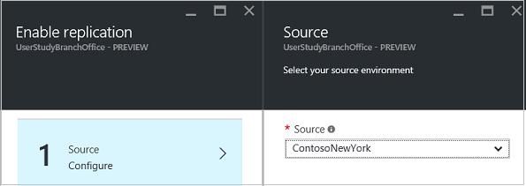
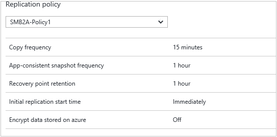

# Step 10: Enable replication for Hyper-V VMs replicating to Azure

This article describes how to enable replication for on-premises Hyper-V virtual machines (not managed by System Center VMM) to Azure, using the [Azure Site Recovery](site-recovery-overview.md) service in the Azure portal.

Post comments and questions at the bottom of this article, or on the [Azure Recovery Services Forum](https://social.msdn.microsoft.com/forums/azure/home?forum=hypervrecovmgr).

## Before you start

Before you start, ensure that your Azure user account has the required [permissions](site-recovery-role-based-linked-access-control.md#permissions-required-to-enable-replication-for-new-virtual-machines) to enable replication of a new virtual machine to Azure.

## Exclude disks from replication

By default all disks on a machine are replicated. You can exclude disks from replication. For example you might not want to replicate disks with temporary data, or data that's refreshed each time a machine or application restarts (for example pagefile.sys or SQL Server tempdb). [Learn more](site-recovery-exclude-disk.md)

## Replicate VMs

Enable replication for VMs as follows:          

1. Click **Replicate application** > **Source**. After you've set up replication for the first time, you can click **+Replicate** to enable replication for additional machines.

    
2. In **Source**, select the Hyper-V site. Then click **OK**.
3. In **Target**, select the vault subscription, and the failover model you want to use in Azure (classic or resource management) after failover.
4. Select the storage account you want to use. If you don't have an account you want to use, you can [create one](#set-up-an-azure-storage-account). Then click **OK**.
5. Select the Azure network and subnet to which Azure VMs will connect when they're created failover.

    - To apply the network settings to all machines you enable for replication, select **Configure now for selected machines**.
    - Select **Configure later** to select the Azure network per machine.
    - If you don't have a network you want to use, you can [create one](#set-up-an-azure-network). Select a subnet if applicable. Then click **OK**.

   

6. In **Virtual Machines** > **Select virtual machines**, click and select each machine you want to replicate. You can only select machines for which replication can be enabled. Then click **OK**.

    

7. In **Properties** > **Configure properties**, select the operating system for the selected VMs, and the OS disk.
8. Verify that the Azure VM name (target name) complies with [Azure virtual machine requirements](site-recovery-support-matrix-to-azure.md#failed-over-azure-vm-requirements).
9. By default all the disks of the VM are selected for replication. Clear disks to exclude them.
10. Click **OK** to save changes. You can set additional properties later.

 	

11. In **Replication settings** > **Configure replication settings**, select the replication policy you want to apply for the protected VMs. Then click **OK**. You can modify the replication policy in **Replication policies** > policy-name > **Edit Settings**. Changes you apply will be used for machines that are already replicating, and new machines.

   

You can track progress of the **Enable Protection** job in **Jobs** > **Site Recovery jobs**. After the **Finalize Protection** job runs the machine is ready for failover.

## Next steps

Go to [Step 11: Run a test failover](hyper-v-site-walkthrough-test-failover.md)
