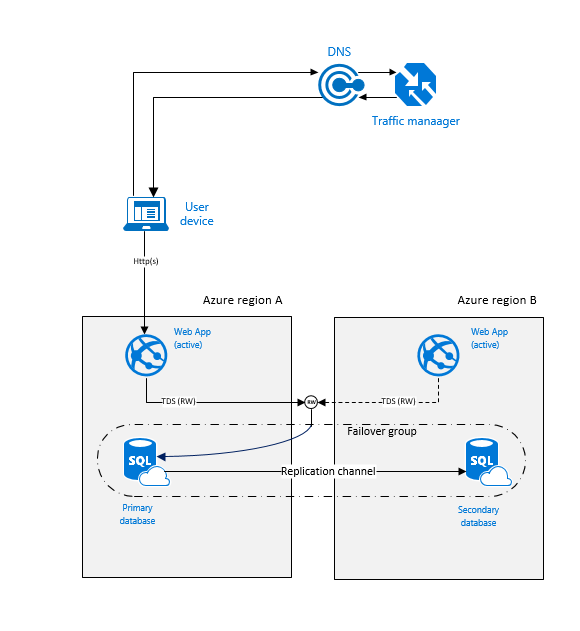
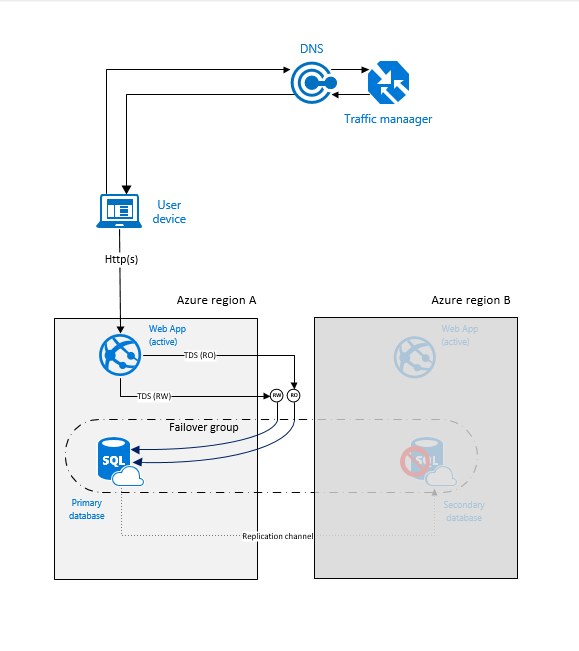
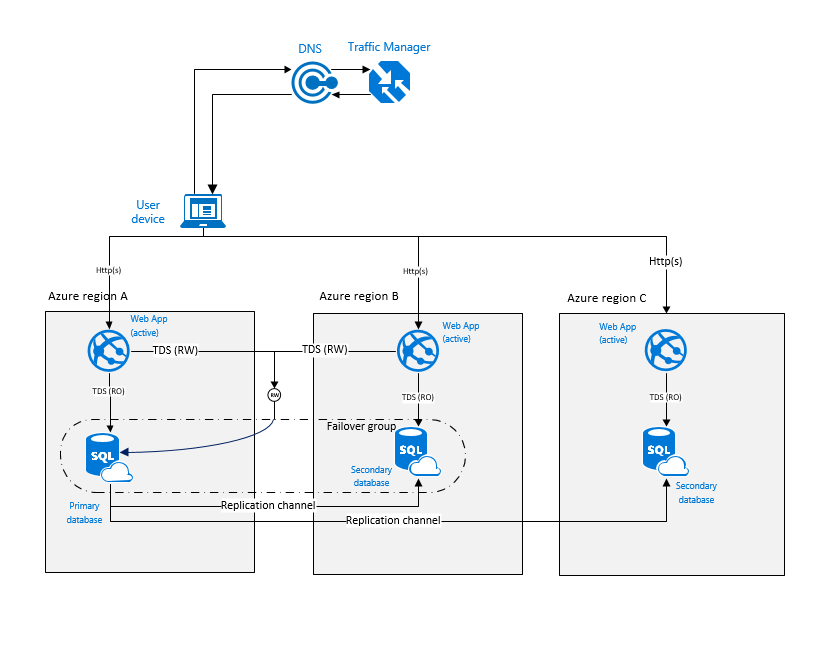
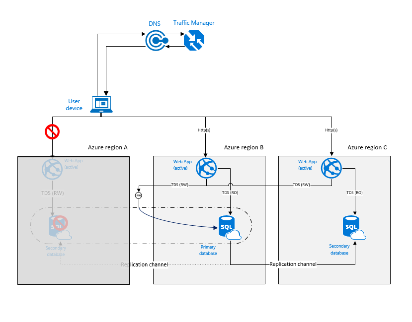
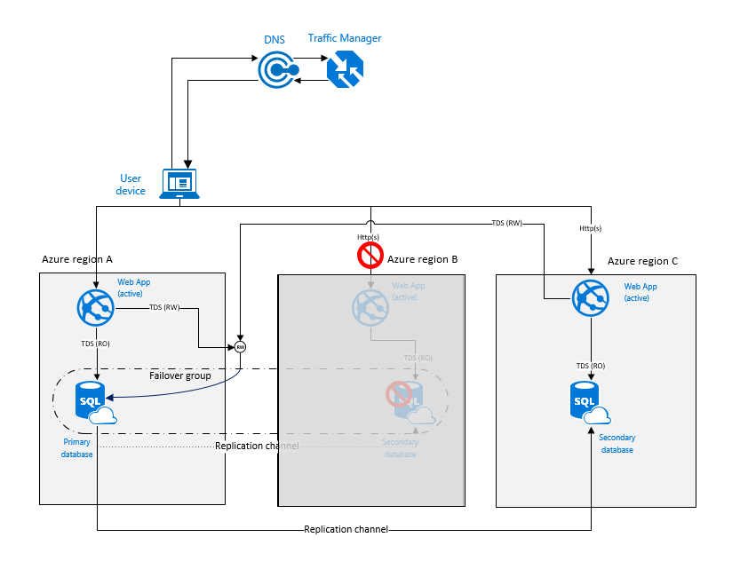
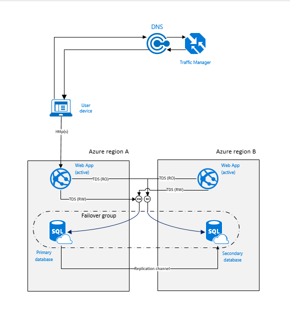
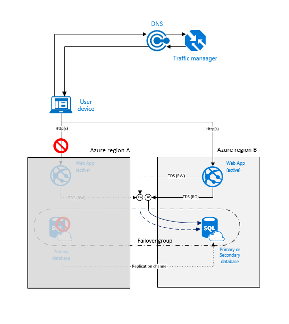
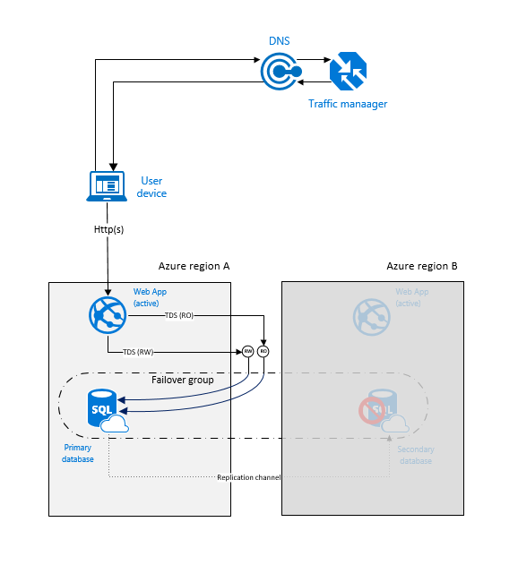

# Designing highly available services using Azure SQL Database

When building and deploying highly available services on Azure SQL Database, you use [failover groups and active geo-replication](sql-database-geo-replication-overview.md) to provide resilience to regional failures and catastrophic outages and enable fast recovery to the secondary databases. This article focuses on common application patterns and discusses the benefits and trade-offs of each option depending on the application deployment requirements, the service level agreement you are targeting, traffic latency, and costs. For information about active geo-replication with Elastic Pools, see [Elastic Pool disaster recovery strategies](sql-database-disaster-recovery-strategies-for-applications-with-elastic-pool.md).

## Design pattern 1: Active-passive deployment for cloud disaster recovery with a co-located database
This option is best suited for applications with the following characteristics:

* Active instance in a single Azure region
* Strong dependency on read-write (RW) access to data
* Cross-region connectivity between the web application and the database is not acceptable due to latency and traffic cost    

In this case, the application deployment topology is optimized for handling regional disasters when all application components are impacted and need to failover as a unit. For geographic redundancy, the application logic and the database are replicated to another region but they are not used for the application workload under the normal conditions. The application in the secondary region should be configured to use a SQL connection string to the secondary database. Traffic manager is set up to use [failover routing method](../traffic-manager/traffic-manager-configure-failover-routing-method.md).  

> [!NOTE]
> [Azure traffic manager](../traffic-manager/traffic-manager-overview.md) is used throughout this article for illustration purposes only. You can use any load-balancing solution that supports failover routing method.    
>

The following diagram shows this configuration before an outage.

After an outage in the primary region, the SQL Database service detects that the primary database is not accessible and trigger a failover to the secondary database based on the parameters of the automatic failover policy. Depending on your application SLA, you can decide to configure a grace period between the detection of the outage and the failover itself. Configuring a grace period reduces the risk of data loss to the cases where the outage is catastrophic and availability in the region cannot be quickly restored. If the endpoint failover is initiated by the traffic manager before the failover group triggers the failover of the database, the web application is not able to reconnect to the database. The application’s attempt to reconnect automatically succeeds as soon as the database failover completes. 

> [!NOTE]
> To achieve fully coordinated failover of the application and the databases, you should devise your own monitoring method and use manual failover of the web application endpoints and the databases.
>

After the failover of both the application’s endpoints and the database completes, the application will re-start processing the user requests in the region B and will remain co-located with the database because the primary database is now in region B. This scenario is illustrated in the following diagram. In all diagrams, solid lines indicate active connections, dotted lines indicate suspended connections, and stop signs indicate action triggers.

If an outage happens in the secondary region, the replication link between the primary and the secondary database is suspended but the failover is not triggered because the primary database is not impacted. The application's availability is not changed in this case, but the application operates exposed and therefore at higher risk in case both regions fail in succession.

> [!NOTE]
> For disaster recovery we recommend the configuration with application deployment limited to two regions. This is because most of the Azure geographies have only two regions. This configuration will not protect your application from a simultaneous catastrophic failure of both regions.  In an unlikely event of such a failure, you can recover your databases in a third region using [geo-restore operation](sql-database-disaster-recovery.md#recover-using-geo-restore).
>

Once the outage is mitigated, the secondary database will automatically re-synchronize with the primary. During synchronization, performance of the primary could be slightly impacted depending on the amount of data that needs to be synchronized. The following diagram illustrates an outage in the secondary region.

The key **advantages** of this design pattern are:

* The same web application is deployed to both regions without any region-specific configuration and no additional logic to react to the failover. 
* The application's performance is not impacted by failover as the web application and the database are always co-located.

The main **tradeoff** is that the redundant application instance in the secondary region is only used for disaster recovery.

## Design pattern 2: Active-active deployment for application load balancing
This cloud disaster recovery option is best suited for applications with the following characteristics:

* High ratio of database reads to writes
* Database read latency is more critical for the end-user experience than the write latency 
* Read-only logic can be separated from read-write logic by using a different connection string
* Read-only logic does not depend on data being fully synchronized with the latest updates  

If your applications have these characteristics, load balancing the end-user connections across multiple application instances in different regions can substantially improve the overall end-user experience. Two of the regions should be selected as the DR pair and the failover group should include the databases in these regions. To implement load-balancing, each region should have an active instance of the application with the read-write (RW) logic connected to the read-write listener endpoint of the failover group. It will guarantee that the failover will be automatically initiated if the primary database is impacted by an outage. The read-only logic (RO) in the web application should connect directly to the database in that region. Traffic manager should be set up to use [performance routing](../traffic-manager/traffic-manager-configure-performance-routing-method.md) with [end-point monitoring](../traffic-manager/traffic-manager-monitoring.md) enabled for each application instance.

As in pattern #1, you should consider deploying a similar monitoring application. But unlike pattern #1, the monitoring application will not be responsible for triggering the end-point failover.

> [!NOTE]
> While this pattern uses more than one secondary database, only the secondary in Region B  would be used for failover and should be part of the failover group.
>

Traffic manager should be configured for performance routing to direct the user connections to the application instance closest to the user's geographic location. The following diagram illustrates this configuration before an outage.

If a database outage is detected in the region A, the failover group will automatically initiate failover of the primary database in region A to the secondary in region B. It will also automatically update the read-write listener endpoint to region B so read-write connections in the web application will not be impacted. The traffic manager will exclude the offline end-point from the routing table but will continue routing the end-user traffic to the remaining online instances. The read-only SQL connection strings will not be impacted as they always point to the database in the same region. 

The following diagram illustrates the new configuration after the failover.

In case of an outage in one of the secondary regions, the traffic manager will automatically remove the offline end-point in that region from the routing table. The replication channel to the secondary database in that region will be suspended. Because the remaining regions get additional user traffic in this scenario, the application's performance will be impacted during the outage. Once the outage is mitigated, the secondary database in the impacted region will be immediately synchronized with the primary. During the synchronization performance of the primary could be slightly impacted depending on the amount of data that needs to be synchronized. The following diagram illustrates an outage in region B.

The key **advantage** of this design pattern is that you can scale the application workload across multiple secondaries to achieve the optimal end-user performance. The **tradeoffs** of this option are:

* Read-write connections between the application instances and database have varying latency and cost
* Application performance is impacted during the outage

> [!NOTE]
> A similar approach can be used to offload specialized workloads such as reporting jobs, business intelligence tools, or backups. Typically, these workloads consume significant database resources therefore it is recommended that you designate one of the secondary databases for them with the performance level matched to the anticipated workload.
>

## Design pattern 3: Active-passive deployment for data preservation
This option is best suited for applications with the following characteristics:

* Any data loss is high business risk. The database failover can only be used as a last resort if the outage is catastrophic.
* The application supports read-only and read-write modes of operations and can operate in "read-only mode" for a period of time.

In this pattern, the application switches to read-only mode when the read-write connections start getting time-out errors. The Web Application is deployed to both regions and include a connection to the read-write listener endpoint and different connection to the read-only listener endpoint. The Traffic manager should be set up to use [failover routing](../traffic-manager/traffic-manager-configure-failover-routing-method.md) with [end-point monitoring](../traffic-manager/traffic-manager-monitoring.md) enabled for the application endpoint in each region.

The following diagram illustrates this configuration before an outage.

When the traffic manager detects a connectivity failure to region A, it automatically switches user traffic to the application instance in region B. With this pattern, it is important that you set the grace period with data loss to a sufficiently high value, e.g. 24 hours. It will ensure that data loss is prevented if the outage is mitigated within that time. When the Web application in the region B is activated the read-write operations will start failing. At that point, it should switch to the read-only mode. In this mode the requests will be automatically routed to the secondary database. In the case of a catastrophic failure the outage will not be mitigated within the grace period and the failover group will trigger the failover. After that the read-write listener will become available and the calls to it will stop failing. This is illustrated by the following diagram.

If the outage in the primary region is mitigated within the grace period, traffic manager detects the restoration of connectivity in the primary region and switches user traffic back to the application instance in region A. That application instance resumes and operates in read-write mode using the primary database in region A.

In case of an outage in the region B, the traffic manager detects the failure of the application end-point in region B and the failover group switches the read-only listener to region A. This outage does not impact the end-user experience but the primary database will be exposed during the outage. This is illustrated by the following diagram.

Once the outage is mitigated, the secondary database is immediately synchronized with the primary and the read-only listener is switched back to the secondary database in region B. During synchronization performance of the primary could be slightly impacted depending on the amount of data that needs to be synchronized.

This design pattern has several **advantages**:

* It avoids data loss during the temporary outages.
* Downtime depends only on how quickly traffic manager detects the connectivity failure, which is configurable.

The **tradeoff** is:

* Application must be able to operate in read-only mode.

> [!NOTE]
> In case of a permanent service outage in the region, you manually activate database failover and accept the data loss. The application will be functional in the secondary region with read-write access to the database.
>

## Business continuity planning: Choose an application design for cloud disaster recovery
Your specific cloud disaster recovery strategy can combine or extend these design patterns to best meet the needs of your application.  As mentioned earlier, the strategy you choose is based on the SLA you want to offer to your customers and the application deployment topology. To help guide your decision, the following table compares the choices based on the estimated data loss or recovery point objective (RPO) and estimated recovery time (ERT).

| Pattern | RPO | ERT |
|:--- |:--- |:--- |
| Active-passive deployment for disaster recovery with co-located database access |Read-write access < 5 sec |Failure detection time + DNS TTL |
| Active-active deployment for application load balancing |Read-write access < 5 sec |Failure detection time + DNS TTL |
| Active-passive deployment for data preservation |Read-only access < 5 sec | Read-only access = 0 |
||Read-write access = zero | Read-write access = Failure detection time + grace period with data loss |
|||

## Next steps
* To learn about Azure SQL Database automated backups, see [SQL Database automated backups](sql-database-automated-backups.md)
* For a business continuity overview and scenarios, see [Business continuity overview](sql-database-business-continuity.md)
* To learn about using automated backups for recovery, see [restore a database from the service-initiated backups](sql-database-recovery-using-backups.md)
* To learn about faster recovery options, see [active geo-replication](sql-database-geo-replication-overview.md)  
* To learn about using automated backups for archiving, see [database copy](sql-database-copy.md)
* For information about active geo-replication with Elastic Pools, see [Elastic Pool disaster recovery strategies](sql-database-disaster-recovery-strategies-for-applications-with-elastic-pool.md).
