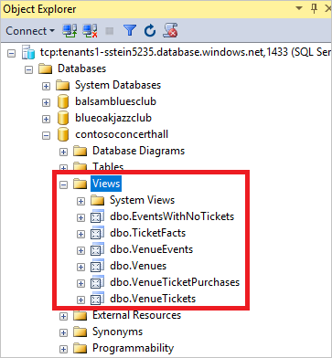
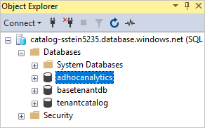
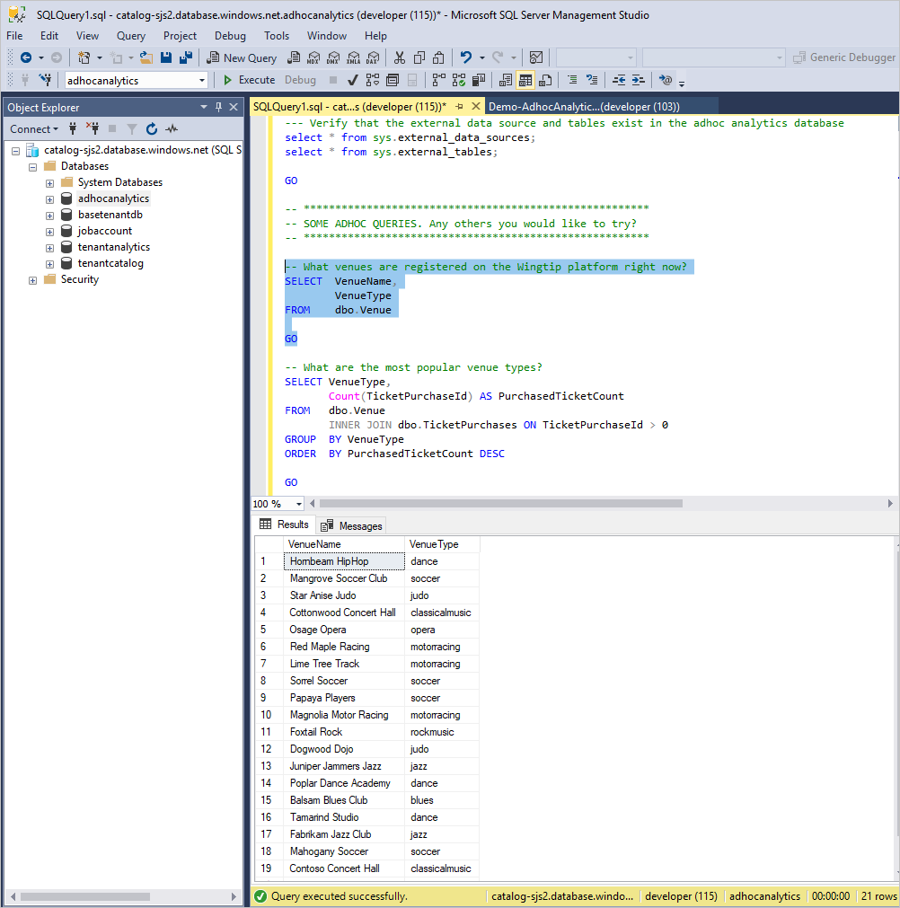

# Run ad-hoc analytics queries across all Wingtip SaaS tenants

In this tutorial, you run distributed queries across tenant databases to enable ad-hoc analytics across all tenants. Elastic Query is used to enable distributed queries, which requires an additional analytics database be deployed (to the catalog server). These queries can extract insights buried in the day-to-day operational data of the Wingtip SaaS app.


In this tutorial you learn:

> [!div class="checklist"]

> * About the global views in each database that enable querying across tenants
> * How to deploy an ad-hoc analytics database
> * How to run distributed queries across all tenant databases


To complete this tutorial, make sure the following prerequisites are completed:

* The Wingtip SaaS app is deployed. To deploy in less than five minutes, see [Deploy and explore the Wingtip SaaS application](sql-database-saas-tutorial.md)
* Azure PowerShell is installed. For details, see [Getting started with Azure PowerShell](https://docs.microsoft.com/powershell/azure/get-started-azureps)
* SQL Server Management Studio (SSMS) is installed. To download and install SSMS, see [Download SQL Server Management Studio (SSMS)](https://docs.microsoft.com/sql/ssms/download-sql-server-management-studio-ssms).


## Ad-hoc analytics pattern

One of the great opportunities with SaaS applications is to use the vast amount of tenant data stored centrally in the cloud. Use this data to gain insights into the operation and usage of your application, your tenants, their users, their preferences, behaviors, etc. These insights should guide feature development, usability improvements, and other investments in your apps and services.

Accessing this data in a single multi-tenant database is easy, but not so easy when distributed at scale across potentially thousands of databases. One approach is to use Elastic Query, which enables querying across a distributed set of databases with common schema. Elastic Query uses a single *head* database in which external tables are defined that mirror tables or views in the distributed (tenant) databases. Queries submitted to this head database are compiled to produce a distributed query plan, with portions of the query pushed down to the tenant databases as needed. Elastic Query uses the shard map in the catalog database to provide the location of the tenant databases. Setup and query are straightforward using standard [Transact-SQL](https://docs.microsoft.com/sql/t-sql/language-reference), and support ad-hoc querying from tools like Power BI and Excel.

By distributing queries across the tenant databases, Elastic Query provides immediate insight into live production data. However, as Elastic Query pulls data from potentially many databases, query latency is often higher than for equivalent queries submitted to a single multi-tenant database.  For this reason, Elastic Query is often best suited for querying small amounts of real-time data, as opposed to building frequently used or complex analytics queries or reports. Queries that require complex analytical processing are better served by extracting tenant data into a dedicated database or data warehouse optimized for analytics queries. This pattern is explained in the [tenant analytics tutorial](sql-database-saas-tutorial-tenant-analytics.md).

## Get the Wingtip application scripts

<<<<<<< HEAD
The Wingtip SaaS scripts and application source code are available in the [WingtipSaaS](https://github.com/Microsoft/WingtipSaaS) github repo. [Steps to download the Wingtip SaaS scripts](sql-database-wtp-overview.md#download-and-unblock-the-wingtip-saas-scripts).
=======
The Wingtip SaaS scripts and application source code are available in the WingtipSaaS github repo. [Steps to download the Wingtip SaaS scripts](sql-database-wtp-overview.md#download-and-unblock-the-wingtip-saas-scripts).
>>>>>>> 4369c0cd9b6629caa8d3a80287e34e4696dfebeb


## Explore the global views

The Wingtip SaaS application is built using a tenant-per-database model, so the tenant database schema is defined from a single-tenant perspective. Tenant-specific information exists in one table, *Venue*, which always has a single row, and is furthermore designed as a heap, without a primary key.  Other tables in the schema don't need to be related to the *Venue* table, because in normal use, there is never any doubt which tenant the data belongs to.  However, when querying across all databases, correlating data from tables in the database to a specific tenant becomes significant. To simplify these queries, a set of views are added to the tenant database that provide a 'global' view of each tenant. These global views project a tenant id into each table that is queried over globally. This tenant id makes it easy to identify data from each tenant. As a convenience, these views have been pre-created in all tenant databases (as well as the golden db, so these global views are available as new tenants are provisioned).

1. Open SSMS and [connect to the tenants1-&lt;USER&gt; server](sql-database-wtp-overview.md#explore-database-schema-and-execute-sql-queries-using-ssms).
1. Expand **Databases**, right-click **contosoconcerthall**, and select **New Query**.
1. Run the following queries to explore the difference between the single-tenant tables and the global views:

   ```T-SQL
   -- The base Venue table, that has no VenueId associated.
   SELECT * FROM Venue

   -- Notice the plural name 'Venues'. This view projects a VenueId column.
   SELECT * FROM Venues

   -- The base Events table, which has no VenueId column.
   SELECT * FROM Events

   -- This view projects the VenueId retrieved from the Venues table.
   SELECT * FROM VenueEvents
   ```

In the sample database we calculated an integer id from a hash of the Venue name, but any approach could be used to introduce a unique value. This approach is similar to how we create the tenant key in the catalog.

To examine a *View*:

1. In **Object Explorer**, expand **contosoconcethall** > **Views**:

   

1. Right-click **dbo.Venues**.
1. Select **Script View as** > **CREATE To** > **New Query Editor Window**

Script any *View* to examine how it's created.

## Deploy the database used for ad-hoc analytics queries

This exercise deploys the *adhocanalytics* database. This database contains the schema used for querying across all tenant databases. The database is deployed to the existing catalog server, which is the server that contains all management-related databases.

1. Open the PowerShell ISE, and load ...\\Learning Modules\\Operational Analytics\\Adhoc Analytics\\*Deploy-AdhocAnalyticsDB.ps1*
1. Scroll down to the section assigning `$commandText` to the SQL script. Review the script and note the following:

   1. Elastic Query uses a database-scoped credential to access each of the tenant databases. This credential needs to be available in all the databases and should normally be granted the minimum rights required to enable these ad-hoc queries.
   1. The external data source, that is defined to use the tenant shard map in the catalog database.  By using this as the external data source, queries are distributed to all databases registered in the catalog at the point the query is issued.
   1. The external tables that reference the global Views described in the previous section.
   1. The local table *VenueTypes* that is created and populated.  This reference data table is common in all tenant databases, so it can be represented here as a local table. For some queries this may reduce the amount of data moved between the tenant databases and the *adhocanalytics* database.


1. Now open ...\\Learning Modules\\Operational Analytics\\Adhoc Analytics\\*Demo-AdhocAnalytics.ps1* in the *PowerShell ISE* and set the following values:
   * **$DemoScenario** = 2, **Deploy Ad-hoc analytics database**.

1. Press **F5** to run the script and create the *adhocanalytics* database.

   It's ok to ignore warnings here about *The RPC server is unavailable*.

You now have an *adhocanalytics* database, that can be used to run distributed queries, and gather insights across all tenants!



## Run Ad-hoc analytics queries

Now that the *adhocanalytics* database is set up, run some ad-hoc queries:

1. Open ...\\Learning Modules\\Operational Analytics\\Adhoc Analytics\\*Demo-AdhocAnalyticsQueries.sql* in SSMS.
1. Ensure you are connected to the **adhocanalytics** database
1. Select the individual query you want to run, and press **F5**:

    


## Next steps

In this tutorial you learned how to:

> [!div class="checklist"]

> * Run distributed queries across all tenant databases
> * Deploy an ad-hoc analytics database


Now try the [Tenant Analytics tutorial](sql-database-saas-tutorial-tenant-analytics.md)

## Additional resources

* Additional [tutorials that build upon the Wingtip SaaS application](sql-database-wtp-overview.md#sql-database-wingtip-saas-tutorials)
* [Elastic Query](sql-database-elastic-query-overview.md)
