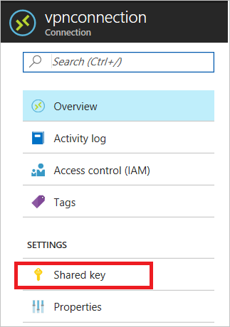

# Troubleshooting: Azure Site-to-Site VPN connection cannot connect and stops working

You configure the Site-to-Site VPN connection between the on-premises network and a Microsoft Azure virtual network. The VPN connection suddenly stops working and cannot be reconnected. This article provides troubleshoot steps to help you resolve this problem. 

[!INCLUDE [support-disclaimer](../../includes/support-disclaimer.md)]

## Troubleshooting steps

To resolve the problem, first try to [reset the Azure virtual network Gateway](vpn-gateway-resetgw-classic.md) and reset the Tunnel from the on-premises VPN device. If the problem persists, follow these steps to identify the cause of the problem.

### Prerequisite step

Check the type of Azure  virtual network gateway:

1. Go to [Azure portal](https://portal.azure.com).
2. Check the **Overview** page of the virtual network gateway for the type information.
    
    

### Step 1 Check whether the on-premises VPN device is validated

1. Check whether  you are using a [validated VPN device and OS version](vpn-gateway-about-vpn-devices.md#a-namedevicetableavalidated-vpn-devices-and-device-configuration-guides). If the device is not a validated VPN device, you may have to contact the device manufacturer to see if there is any compatibility issue.
2. Make sure that the VPN device is in a correctly configured. For more information, see [Editing device configuration samples](/vpn-gateway-about-vpn-devices.md#editing).

### Step 2 Verify the Shared Key(PSK)

Compare the **Shared Key** from the on-premises VPN device and the virtual network VPN to make sure that the keys match. 

To view the PSK for the Azure VPN connection, use one of the following methods：

**Azure portal**

1. Go to Virtual network gateway > Site to site connection you created.
2. In the **Settings** section, click **Shared Key**.
    
    

**Azure PowerShell**

For Resource Manager mode

    Get-AzureRmVirtualNetworkGatewayConnectionSharedKey -Name <Connection name> -ResourceGroupName <Resource group name>

For Classic

    Get-AzureVNetGatewayKey -VNetName -LocalNetworkSiteName

### Step 3 Verify the VPN Peer IPs

-	The IP definition in the **Local Network Gateway** object in Azure should match the on-premises device IP.
-	The Azure Gateway IP definition that is set on the on-premises device should match the Azure gateway IP.

### Step 4 NSG and UDR on Gateway Subnet

Check for and remove User Defined Routing (UDR) or Network Security Groups (NSG) on the Gateway Subnet, and then test the result. If the problem is resolved, validate the settings of NSG or UDR applied.

### Step 5 Check on-premises VPN device external interface address

- If the Internet facing IP address of the VPN device is included in the **Local network** definition in Azure, you may experience sporadic disconnections.
- The device's external interface must be directly on the Internet. There should be no Network Address Translation or firewall between the Internet and the device.
-  If you configure Firewall Clustering to have a virtual IP, you must break the cluster and expose the VPN appliance directly to a public interface that the gateway can interface with.

### Step 6 Verify  Subnets Match Exactly (Azure Policy-Based Gateways)

-	Verify that subnets match exactly between the Azure Virtual Network and on-premises definitions for the Azure Virtual Network.
-	Verify that subnets match exactly between the **Local Network Gateway** and on-premises definitions for on-premises network.

### Step 5 Verify Azure Gateway health probe

1. Browse to https://&lt;YourVirtualNetworkGatewayIP&gt;:8081/healthprobe
2. Click through the certificate warning.
3. If you receive a response, the virtual network gateway is considered to be healthy. If you do not receive a response, the gateway may not be healthy or there is a NSG on the gateway subnet that is causing the problem. The following text is a sample response:

    &lt;?xml version="1.0"?>
    <string xmlns="http://schemas.microsoft.com/2003/10/Serialization/">Primary Instance: GatewayTenantWorker_IN_1 GatewayTenantVersion: 14.7.24.6</string&gt;

### Step 7 Check whether the on-premises VPN device has Perfect Forward Secrecy (PFS) feature enabled

The Perfect Forward Secrecy feature can cause the disconnection problems. If the VPN device has Perfect Forward Secrecy enabled, disable the feature. Then update the virtual network gateway IPsec policy.

## Next steps

-	[Configure a Site-to-Site connection to a virtual network](vpn-gateway-howto-site-to-site-resource-manager-portal.md)
-	[Configure IPsec/IKE policy for Site-to-Site VPN connections](vpn-gateway-ipsecikepolicy-rm-powershell.md)
