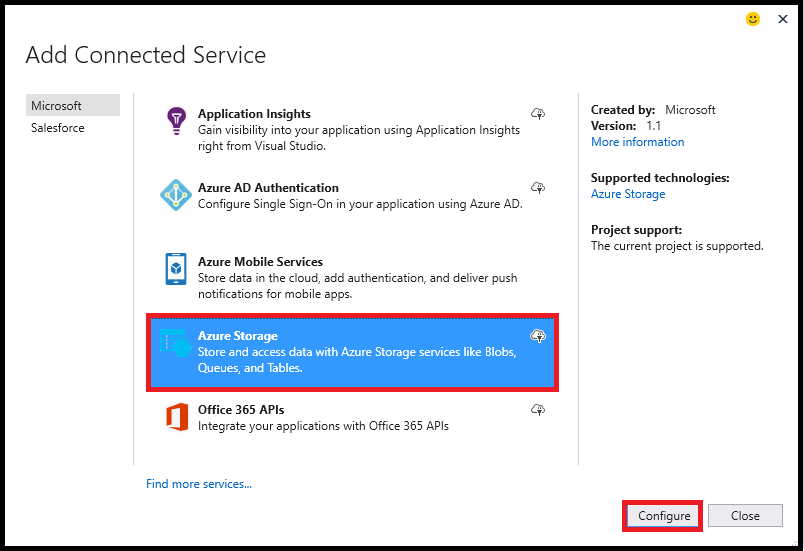

## Set up the development environment

This section walks you setting up your development environment, including creating an ASP.NET MVC app, adding a Connected Services connection, adding a controller, and specifying the required namespace directives.

### Create an ASP.NET MVC app project

1. Open Visual Studio.

1. Select **File->New->Project** from the main menu

1. On the **New Project** dialog, specify the options as highlighted in the following figure:

	

1. Select **OK**.

1. On the **New ASP.NET Project** dialog, specify the options as highlighted in the following figure:

	

1. Select **OK**.

### Use Connected Services to connect to an Azure storage account

1. In the **Solution Explorer**, right-click the project, and from the context menu, select **Add->Connected Service**.

1. On the **Add Connected Service** dialog, select **Azure Storage**, and then select **Configure**.

	

1. On the **Azure Storage** dialog, select the desired Azure storage account with which you want to work, and select **Add**.
